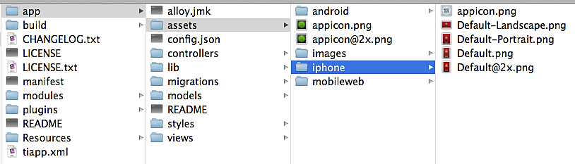

theme:appcelerator-training
tableclass:striped
progress:true

# Cross Platform Strategies

Appcelerator SDK Fundamentals

---cover

# Cross Platform Strategies

## Appcelerator SDK Fundamentals

--- 

# In this lesson, you will:

- Identify options for cross-platform development
- Implement conditional statements 
- Implement style sheet conditions
- Learn about app configuration
- Identify platform-specific folders

---section

# PLATFORM HANDLING

## "Write once, adapt everywhere"

--- 

# Platform & Form Factor

- App assets
- Conditional code
- Markup-based Techniques
- TSS-based Qualifiers
- Platform Build-time Folders

--- 

# Asset Folders

- `app/assets/iphone`
- `app/assets/android`
- `app/assets/mobileweb`



---

# Platform Overrides

- `app/views/iphone/...`
- `app/views/android/...`
- `app/views/mobileweb/...`


---

# Conditional Code

- OS_IOS
- OS_ANDROID
- OS_MOBILEWEB
- ENV_DEV
- ENV_TEST
- ENV_PRODUCTION

```javascript
if (ENV_DEV && OS_IOS) {
     alert("You are running iOS in the simulator");
}
```


---code

# Platform and Device Markup

```xml
<Alloy>
   <Window class="container">
         <View formFactor="handheld">
              <Label>I'm a handheld!</Label>
         </View>

         <View formFactor="tablet">
               <Label>I'm a tablet!</Label>
         </View>

         <View height="50" width="200" bottom="10" backgroundColor="#cdcdcd">
               <Label class="platformLbl" platform="android" formFactor="tablet">android tablet</Label>
               <Label class="platformLbl" platform="android" formFactor="handheld">android handset</Label>
               <Label class="platformLbl" platform="ios" formFactor="tablet">ios tablet</Label>
               <Label class="platformLbl" platform="ios" formFactor="handheld">ios handset</Label>
         </View>
   </Window>
</Alloy>
```

---code

# TSS-based Qualifiers

```css
"#mybutton[platform=android]" : {
               height:'40dp',
}
"#mybutton[platform=ios]" : {
               height:50,
}
"#osLabel[platform=ios formFactor=tablet]": {
text: "iPad"
}
"#osLabel[platform=ios formFactor=handheld]": {
text: "iPhone"
}
```

--- 

# Custom Query Styles

- Define a conditional statement, which returns a boolean value, and assign it to a property in the Alloy.Globals namespace.
- Assign the if attribute to an element in the XML file or in the conditional block of the TSS file to the defined query with the Alloy.Globals namespace.

**Example**

alloy.js

```javascript
Alloy.Globals.isIos7Plus = (OS_IOS && parseInt(Ti.Platform.version.split(".")[0]) >= 7);
Alloy.Globals.iPhoneTall = (OS_IOS && Ti.Platform.osname == "iphone" && Ti.Platform.displayCaps.platformHeight == 568);
```

index.xml

```xml
<Alloy>
    <Window>
	<Label id="title" textid="title"/>
	<ScrollView id=‘Scrollview’ />
    </Window>
</Alloy>
```

index.tss

```css
“#title[if=Alloy.Globals.isIos7Plus]" : {
    top: '25dp', // compensate for the status bar on iOS 7
},"ScrollView[if=Alloy.Globals.iPhoneTall]" : {
    height : '500dp'
}
```

--- 

# Try It

- Assign some elements in your application to only be available for iOS and other only for Android
- Use different styles for tablets and handhelds
- Use custom queries to display certain elements when using emulators

---section

# Configuration and Themes

---code

# Global Configuration

```javascript

// app/config.json
{
   "global": { "foo": 1},
   "env:development": {},
   "env:test": {},
   "env:production": {},
   "os:ios": { "foo": 2 },
   "os:android": {},
   "dependencies": {}
}

// In a controller
alert(Alloy.CFG.foo); // value is 1 or 2 depending on OS

```

---code 

# Themes

- Named collection of styles and assets
- Applied via setting in the config.json file (can be platform-specific)
- Theme settings override base styles and assets
- Overrides are made on an attribute by attribute basis, not whole files

```
app/
	assets/
		appicon.png
		background.png
styles/
	app.tss
	index.tss
themes/
	mytheme/
		assets/
			background.png
		styles/
			app.tss
	green/
	...
```

---code

# Using Themes

```javascript

// config.json

{
    "global": {
        "theme":"mytheme"
    },
    "env:development": {},
    "env:test": {},
    "env:production": {},
    "os:ios": {
        "theme":"green"
    },
    "os:android": {
        "theme":"blue"
    },
    "dependencies": {}
}
```

---code

# Using Themes

Themes directory

```
app/
    assets/
        appicon.png
        background.png
styles/
    app.tss
    index.tss
themes/
    mytheme/
        assets/
            background.png
        styles/
            app.tss
    green/
    ...
```

---

# Try It

- Examine the conditional code in Fugitives.js and FugitiveDetails.js
- Examine platform selectors in FugitiveDetails.tss
- Compare the graphic assets for Android and iOS

--- 


# Alloy vs. “Traditional” / “Legacy”

- It's not all or nothing - `Ti.UI.createView()` and its friends are still valid.
- API techniques used within the controllers, in helper libraries (network, database, etc.)
- Alloy is essentially a pre-compiler
- In the end, Alloy creates traditional code for you — check out the Resources folder!

---

# Summary

In this lesson, you:

- Identified the role of the Alloy MVC components
- Discussed app configuration and platform options
- Learned about Alloy themes
- Identified options for handling platform differences in Alloy

---section

# Questions?
