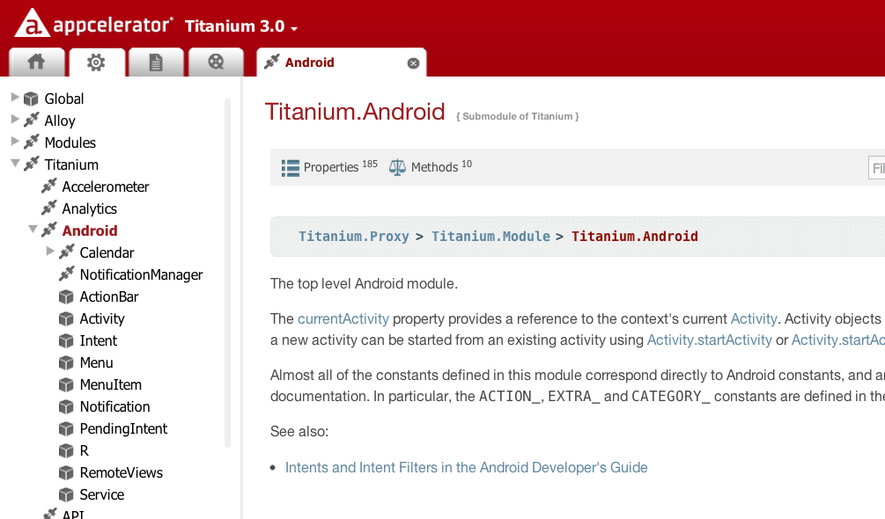
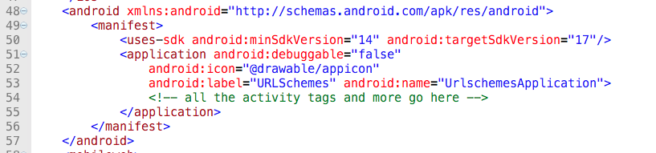
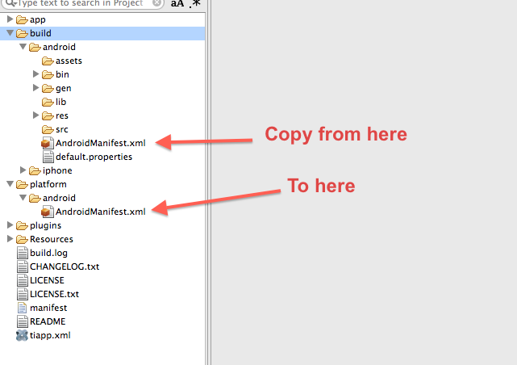
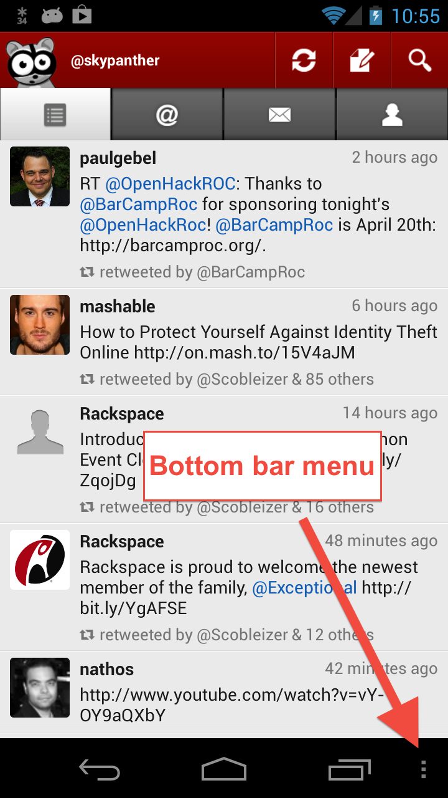
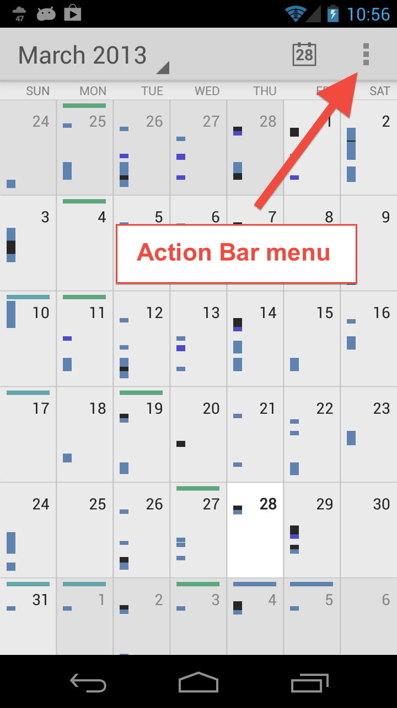
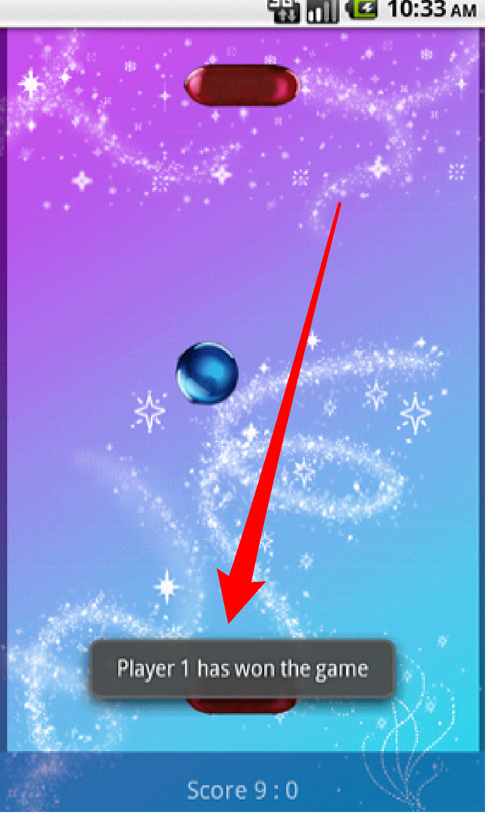

theme:appcelerator-training
tableclass:striped
progress:true

# Android Deep Dive

Appcelerator SDK Fundamentals

---cover

# Android Deep Dive

## Appcelerator SDK Fundamentals

---

# In this lesson, you will:

- Identify the strength and weaknesses of the Android platform
- Explore Android components and vocabulary
- Configure Android apps using native configuration techniques
- Implement Android UI APIs
- Implement Android non-visual APIs

---section

# PLATFORM CHARACTERISTICS

---

# Android Platform Strengths

- Open nature (hackable)
- Variety of app distribution methods
- Range of devices: low-cost to high-end
- Java-based environment (common skill set)
- Strongly integrated into the Google ecosystem (identity, Google Apps, data sharing)

---

# Android Platform Weaknesses

- Slow OS upgrades on user devices
- Carrier themes add a layer of complexity in UI design
- Large distribution of device screen types, hardware capabilities, etc.
- Open nature (hackable)
- Less active app economy (fewer 99-cent purchases)

---

# Many devices & form factors
Phones, tablets, various operating system versions, vendor skins, carrier add-ons, forked versions

Need to test as widely as possible ... on device

---section

# ANDROID COMPONENTS

---

# Android Application Key Components

- Activities
- Services
- Broadcast Receivers
- Intents
  - Pending Intents

It is necessary to understand and implement these in AppC to provide a truly native experience

> **TIP:** Read the official [Android fundamentals](http://developer.android.com/guide/topics/fundamentals.html) docs.

---

# Activity

> 'An activity is a single, focused thing that the user can do. Almost all activities interact with the user, so the Activity class takes care of creating a window for you in which you can place your UI’

For example, an email app might have one activity that shows a list of new emails, another activity to compose an email, and another activity for reading emails.

---

# Service

> 'A Service is an application component representing either an application's desire to perform a longer-running operation while not interacting with the user or to supply functionality for other applications to use.’

For example, a service might play music in the background while the user is in a different app

---

# Broadcast Receiver

> 'A broadcast receiver is a component that responds to system-wide broadcast announcements’

For example, a broadcast announcing that the screen has turned off, the battery is low, or a picture was captured

---

# Intent

> 'Three of the core components of an application - activities, services, and broadcast receivers - are activated through messages, called intents.'

[http://developer.android.com/guide/topics/intents/intents-filters.html](http://developer.android.com/guide/topics/intents/intents-filters.html)

---

# Pending Intent

> A Pending Intent is an intent you give to another application to perform on your app's behalf at a future time.

[http://developer.android.com/reference/android/app/PendingIntent.html](http://developer.android.com/reference/android/app/PendingIntent.html)

---

# All of these work in Appcelerator



---section

# ANDROID CONFIGURATION

---

# AndroidManifest.xml

- Native configurations done in `AndroidManifest.xml`
- Most of those properties can be set in the `tiapp.xml`
- Or, use a custom AndroidManifest.xml
- Examples: app permissions, orientation handling, version number customization, native themes, tooling, etc.

---

# Configuration in Tiapp.xml



1. Build once to generate stock `build/android/AndroidManifest.xml`
2. Copy pertinent tags from generated file (e.g. all of the `<application>` block)
3. In `tiapp.xml`, edit `<android .../>` to be block rather than closed tag
4. Add `<manifest></manifest>` tags
5. Paste in generated code, edit as needed

---

# Custom Android Manifest



---

# Try It

- Create an android manifest and add to the project

---section

# ANDROID UI APIS

---

# Windows and Activities

- Window == Activity
- Windows are default heavyweight (activities).  Lightweight (full-screen views) windows
- Menus, title bars, and more are associated with the activity.
- Enter & exit animations on activities
- You can set the theme of the window. It can be either a built-in theme or a custom theme.
- In a TabGroup, the activity is associated with the TabGroup not the windows

```javascript
var win = Ti.UI.createWindow({theme: "Theme.AppCompat.Fullscreen"});
win.open({ 
     activityEnterAnimation: Ti.Android.R.anim.slide_in_left, 
     activityExitAnimation: Ti.Android.R.anim.slide_out_right 
}); 
```

---

# Action Bar / Hardware Menu

- Menu of options displayed when "hardware" button is pressed
- Associated with activity (heavyweight window)
- The action bar is displayed by default (3.3.x+).
- Pre-ICS: shown at bottom of screen as slide up tray
- ICS: either in Action Bar or in bottom bar as ellipsis button




---

# Menu Example

**View**

```xml
<Alloy>
    <Window title="My Test App">
        <Menu id="menu" platform="android" title="My XML Menu" onHomeIconItemSelected="doMenuClick">
            <MenuItem id="item1" title="Settings" onClick="openSettings" />
            <MenuItem id="item2" title="Search" onClick="doSearch" />
        </Menu>
        <Label id="label">Welcome!</Label>
    </Window>
</Alloy>
```

**Stylesheet**

```javascript
"MenuItem": {
    showAsAction: Ti.Android.SHOW_AS_ACTION_ALWAYS
},
"#item1": {
    icon: Ti.Android.R.drawable.ic_menu_preferences
},
"#item2": {
    icon: Ti.Android.R.drawable.ic_menu_search
},
"#menu": {
    icon: "/actionicon.png",
    displayHomeAsUp: true,
    backgroundImage: "/actionbackground.png"
}
```

---

# Menu, Continued

`tiapp.xml`

```xml
<android xmlns:android="http://schemas.android.com/apk/res/android"> 
     <manifest> 
	   <!-- target SDK 14+ (Android 4.0) to get ActionBar style menus 
			default if you omit uses-sdk is to target highest installed --> 
	   <uses-sdk android:minSdkVersion="10" android:targetSdkVersion="14"/> 
	   <!-- other manifest entries including <application> tag--> 
     </manifest> 
</android> 
```

> **NOTE:** To get the ActionBar style menu, you just need to build with a current SDK, which is the default.

---

# Try It

- Add a menu to previous project
- Use Genymotion if possible

---

# Menus in TabGroups

- TabGroups are the activity (not the windows)
- So menu code goes inside the tab group
- One menu for whole app
- Call Ti.Android.invalidateOptionsMenu() within Window to re-create a menu (i.e. have separate menus for each window)

```xml
<Alloy> 
     <TabGroup id='tabGroup'> 
	    <Require src="Fugitives" id="fugitivesTab"/> 
	    <Require src="Captured" id="capturedTab"/> 
	    <Menu> 
		   <MenuItem title="Add" onClick="addNewFugitive"/> 
	    </Menu> 
     </TabGroup> 
</Alloy> 
```

---

# Installing to the SD card

- Must build with SDK tools 8 or higher (default is to use highest installed)
- Set minSdkVersion to 10 or higher
- Options are preferExternal, preferInternal, or auto (default)

```xml
<android xmlns:android="http://schemas.android.com/apk/res/android"> 
     <manifest android:installLocation="preferExternal"> 
	   <uses-sdk android:minSdkVersion="10" /> 
     </manifest> 
</android> 
```

---

# NinePatch images

- Avoid stretched splash screens
- Define stretchable areas of your graphic
- Enable through Android theme modification


---

# Using a NinePatch for the Splash Screen

- Create a NinePatch image using draw9patch utility
- Copy to `platform/android/res/drawable[-xdpi]`
- Rename it to `splash.9.png`
- Create a `theme.xml` file, put it in `platform/android/res/values`

```xml
<?xml version="1.0" encoding="utf-8"?> 
<resources> 
  <style name="Theme.Titanium" parent="android:Theme">
    <item name="android:windowBackground"></item>
    <item name="android:windowNoTitle">true</item>
  </style> 
</resources> 
```

---

# Try It

- Open draw9patch tool
- Select an image and draw section that will scale

---

# Android Labels

- Use Label.html to apply formatting like you would use AttributedStrings on iOS
- Use Label.autoLink to "linkify" URLs, phone numbers, address, etc.
- autoLink also works on TextAreas

```javascript
"Label":{
	autoLink : Ti.UI.AUTOLINK_ALL
}
```

- Ti.UI.AUTOLINK_ALL - linkify all possible forms of links
- Ti.UI.AUTOLINK_EMAIL_ADDRESSES – linkify just email addresses
- Ti.UI.AUTOLINK_MAP_ADDRESSES – linkify just map addresses
- Ti.UI.AUTOLINK_PHONE_NUMBERS – linkify just phone numbers
- Ti.UI.AUTOLINK_URLS – linkify just Web addresses

---

# Toast "Pop-up" Notifications

- Simple text display over all activities
- Can control positioning on screen
- Rendering will be different based on OS version and skin



```javascript
var n = Ti.UI.createNotification({message:"Howdy folks"}); 
n.duration = Ti.UI.NOTIFICATION_DURATION_LONG; 
// or NOTIFICATION_DURATION_SHORT 

// Setup the X & Y Offsets 
n.offsetX = 100; 
n.offsetY = 75; 

n.show(); 
```

---

# Status Bar Notifications

- Use the NotificationManager module to send and cancel notifications.
- Invoke using Intents
- Example:[http://docs.appcelerator.com/titanium/latest/#!/api/Titanium.Android.NotificationManager](http://docs.appcelerator.com/titanium/latest/#!/api/Titanium.Android.NotificationManager)


---

# Hijacking the Back Button

- Override default Back button behavior
- Example: wizard interface where you want to go back a screen
- Careful about user expectations
- Demo: AndroidBackDemo

---section

# NON-VISUAL APIS

---

# Launching Activities

- You can launch other apps (activities) from JS
- Need to have an intent object to pass
- Many built in intents to use

Forging Titanium #9 - Android Intents Cookbook
[http://bit.ly/ryOSW4](http://bit.ly/ryOSW4)

---

# Example

```javascript
// create an Android intent whose action is to send plain text data 
var intent = Ti.Android.createIntent({ 
     action: Ti.Android.ACTION_SEND, 
     type: 'text/plain' 
}); 
// define two extra fields for the intent 
intent.putExtra(Ti.Android.EXTRA_SUBJECT, 'Isn\'t This Cool!'); 
intent.putExtra(Ti.Android.EXTRA_TEXT, $.message.value); 

try { 
     Ti.Android.currentActivity.startActivity(intent); 
} catch (ex) { 
     /* Handle Exception if no suitable apps installed */ 
     Ti.UI.createNotification({ message : 'No sharing apps installed!' }).show(); 
} 
```

---

# Service Support

Run JavaScript-based services in the background
Must be started by your app, but can survive when you exit the app
Runs on an interval you specify
Can access many non-UI Appcelerator APIs (networking, eventing, etc.)

---

# Example

`app/lib/logservice.js`

```javascript
// This is the service, use non-UI 
Ti APIs Ti.API.info("Hello world, I'm a service"); 
```

```xml
<!-- tiapp.xml --> 
<android xmlns:android="http://schemas.android.com/apk/res/android"> 
     <services> 
	<service url="logservice.js" 
	     type="interval"/> 
     </services> 
</android>  
```

```javascript
// in index.js or other controller 
var SECONDS = 10; // every 10 seconds 
var intent = Titanium.Android.createServiceIntent({ 
     url: 'logservice.js' 
}); 
intent.putExtra('interval', SECONDS * 1000); // Needs to be milliseconds 
Ti.Android.stopService(intent); // later, to stop the service! 
```

---

# Application Resources

- JS access to R.java - http://developer.android.com/reference/android/R.html
- R.drawable - built in icons for ImageView, etc.
- R.string - OS localized string for 'OK', 'Cancel', etc
- Android docs required to see properties

---

# Summary

In this lesson, you:

- Identified the strength and weaknesses of the Android platform
- Explored Android components and vocabulary
- Configured Android apps using native configuration techniques
- Implemented Android UI APIs
- Implemented Android non-visual APIs

---section

# Questions?