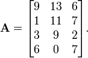
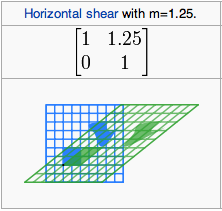
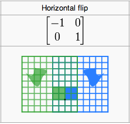
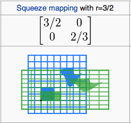
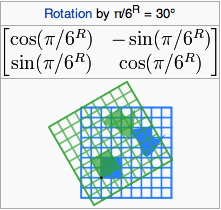
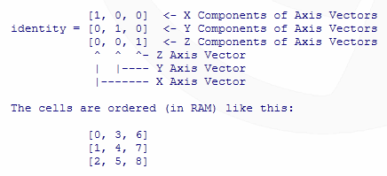
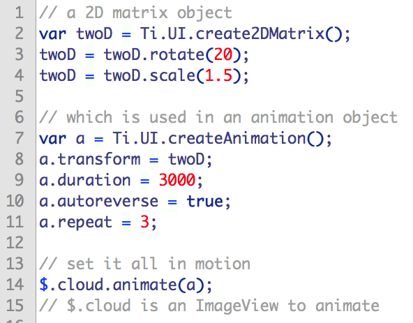

theme:appcelerator-training
tableclass:striped
progress:true

# Animations

Appcelerator SDK Fundamentals

---cover

# Animations

## Appcelerator SDK Fundamentals

--- 

# In this lesson, you will:

In this lesson, you will:

- Learn key animation concepts
- Animate the properties of views
- Animate views with 2D and 3D matrix operations
- iOS – specific animations and transitions

--- 

# Simple Usage

Simple: use `obj.animate()`

```javascript
circle.animate({
  top:200,
  right:30,
  duration:500
},function() {
  circle.animate({
    top:0,
    left:0,
    duration:500
  });
});
```

- Hash of properties are properties of a Ti.UI.Animation object
- To reuse animations, create an object which can be passed to animate():

---section

# MATRIX TRANSFORMATIONS

--- 

# Matrix Animation

**What is a matrix? **

For animations, is a set of properties that describe the transformation of an object in a manner that a computer can process and execute 


- It offers more options for animation
- [http://en.wikipedia.org/wiki/Matrix_(mathematics)](http://en.wikipedia.org/wiki/Matrix_(mathematics))  if you're interested 

---

# Matrix 2D animations


Transform objects in 2D space 

- Rotate
- Scale
- Skew 
- Associated with animation object
---

# 2D Matrix




Matrices and matrix multiplication reveal their essential features when related to linear transformations, also known as linear maps.

**2D Matrix Examples**






---

# Example Matrix 2D Animation

```javascript
var twoD = Ti.UI.create2DMatrix();
twoD = twoD.rotate(20);
twoD = twoD.scale(1.5);

// which is used in animation object
var a = Ti.UI.createAnimation();
a.transform = twoD;
a.duration = 3000;
a.autoreverse = true;
a.repeat = 3;

// set it all in motion
$.cloud.animate(a);
```

---

# Try It

From last project:

- Apply a 2D transformation to an element

---

# Matrix 3D Animation (iOS)



Transforming objects in 3D space 

- Rotate
- Scale
- Skew
- Associated with animation object

---

# 3D Matrix

A 3D matrix is used to rotate, scale, translate, or skew the objects through space.


---

# Example Matrix 3D Animation

```javascript
var threeD = Ti.UI.iOS.create3DMatrix();
threeD = threeD.rotate(180, 1, 1, 0);
threeD = threeD.scale(2.0, 2.0, 2.0);
// modify value at a specific matrix location
threeD.m34 = 1.0/-1500;

// use the matrix in an animation object
var a = Ti.UI.createAnimation();
a.transform = threeD;
a.duration = 3000;
a.autoreverse = true;
a.repeat = 3;

// set it all in motion
$.cloud.animate(a);
```

---

# Transitions (iOS Only)

- iOS only feature
- Built-in 3D transformations
- Page curl, flip, etc.
- Apply to Window or View

---

# Alloy Animation Built-ins

- Pre-built animation effects
- `require()` in the animation library, then call on your View(s)
- `crossFade()`, `fadeAndRemove()`, `fadeIn()`, and more

See [https://github.com/appcelerator/alloy/blob/master/Alloy/builtins/animation.js](https://github.com/appcelerator/alloy/blob/master/Alloy/builtins/animation.js)

---

# Example

```javascript
// in the view controller 

// require in the animation built-in 
var animation = require('alloy/animation'); 

$.loginButton.addEventListener('click', function() { 
     var loginFailed = validate(); // contrived example 
     if(loginFailed) { 
	animation.shake($.loginButton, 30); // ← here's the animation 
     } else { 
	// do whatever 
     } 
}); 
```

---

# Try It

From last project:

- Add an Alloy built-in animation
- Use the flip (3D flip animation) for iOS

---section

# iOS-specific Animations

---

# iOS Animated Transitions

```javascript
var transition = Ti.UI.iOS.createTransitionAnimation({ 
     duration: 300, 
     // The show transition makes the window     // opaque and rotates it upright 
     transitionTo: { 
	   opacity: 1, 
	   duration: 300, 
	   transform: Ti.UI.create2DMatrix() 
     }, 
     // The hide transition makes the window transparent 
     // and rotates it upside down
     transitionFrom: { 
	   opacity: 0, 
	   duration: 300 / 2, 
	   transform: Ti.UI.create2DMatrix().rotate(180), 
     } 
}); 
```

```javascript
$.openButton.addEventListener('click', function(){ 
     var win2 = Alloy.createController("win2", {trans: transition}); 
     $.navWindow.openWindow(win2); 
}); 

$.navWindow.open(); 
```

---

# Animator to add Physics Effects

- Titanium.UI.iOS.Animator object
- Add physics-related capabilities and animations using the iOS physics engine
  - Behaviors: define rules of the animator
  - Items: assigned one or more behaviors
  - Start with `startAnimator()`

---

# Animator Example


```javascript
// Create an Animator object using the window as the coordinate system 
var animator = Ti.UI.iOS.createAnimator({referenceView: $.win}); 

// Create default collision behavior, window// edges as boundaries 
var collision = Ti.UI.iOS.createCollisionBehavior(); 

// Simulate Earth's gravity
 var gravity = Ti.UI.iOS.createGravityBehavior({ 
     gravityDirection: {x: 0.0, y: 1.0} 
}); 
```

```javascript
// Create a bunch of random blocks; add to the// window and behaviors 
var blocks = []; 
for (var i = 0; i < 20; i++) { 
     blocks[i] = Alloy.createController('box').getView(); 
     $.win.add(blocks[i]); 
     collision.addItem(blocks[i]); 
     gravity.addItem(blocks[i]); 
} 
animator.addBehavior(collision); 
animator.addBehavior(gravity); 

// Start the animation when the window opens 
$.win.addEventListener('open', function(e){ 
     animator.startAnimator(); 
}); 

$.win.open();
```

---

# Try It

- Create a new project or add a view to last project
- Use the iOS 7 animator and use the code from previous slides.

---

# Summary

In this lesson, you:

- Learned key animation concepts
- Animated the properties of views
- Animated views with 2D and 3D matrix operations
- Use Built-in Alloy animations

---section

# Questions?