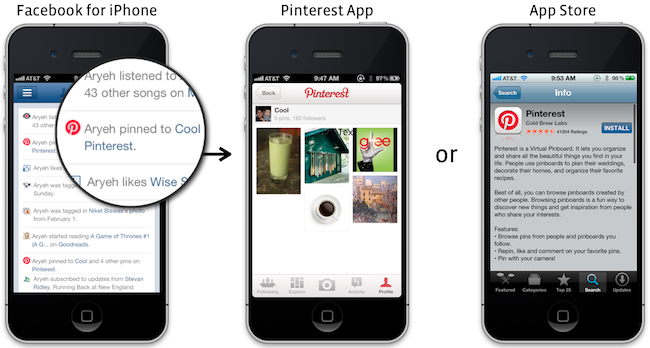
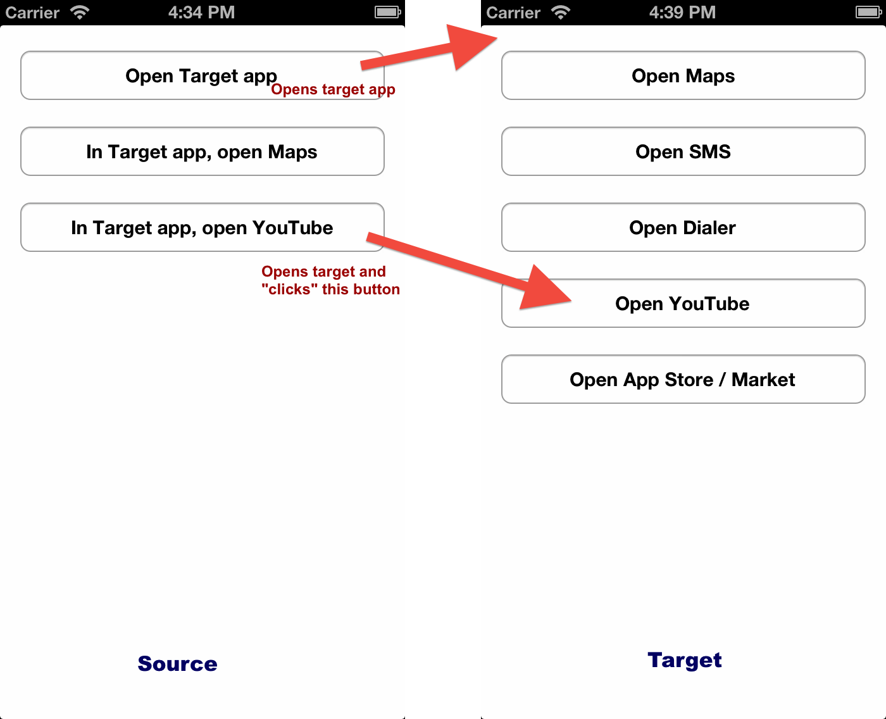
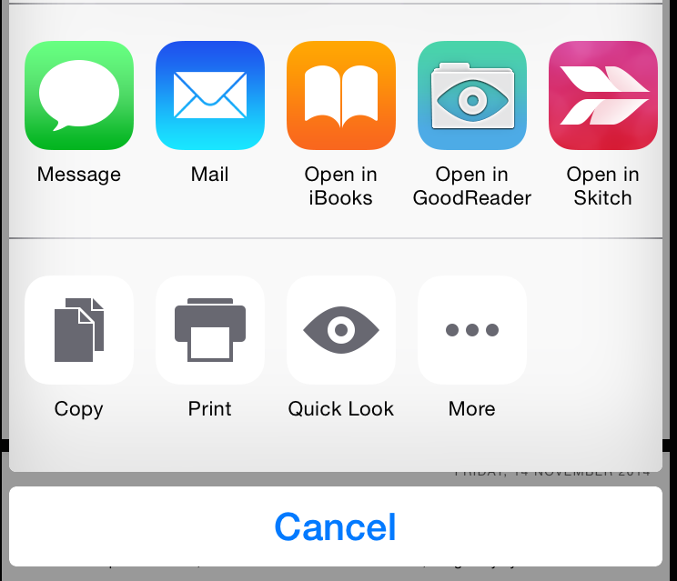
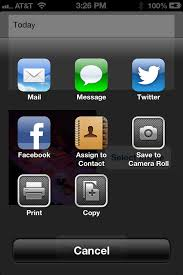

theme:appcelerator-training
tableclass:striped
progress:true

# App Connections

Appcelerator SDK Fundamentals

---cover

# App Connections

## Appcelerator SDK Fundamentals

---

# In this lesson, you will:

- Launch native and third-party apps
- Configure your app's URL scheme
- Pass data between apps
- Pulling data from enterprise systems and Mobile Backend as a Service (MBaaS)

---section

# LAUNCH OTHER APPS

---

# Opening Other Apps

```Ti.Platform.openURL()```

- Need to know the "URL scheme"
- On Android, launch an intent directly

---

# Common URL Schemes

|Maps||
|iOS|maps://|maps://maps.google.com/maps?q=440+Bernardo+Ave,+Mountain+View|
|iOS|comgooglemaps://|comgooglemaps://?center=40.76581,-73.97586&zoom=14|
|Android|geo:|geo:0,0?q=440+Bernardo+Ave,+Mountain+View,+CAhttp://maps.google.com/maps?q=440+Bernardo+Ave,+Mountain+View,+CA|
|||
|SMS|sms:|sms:+1234567890   (no // is used)|
|Phone|tel:|tel:408-555-1212 (no // is used)|
|Mail|mailto://|mailto://fake@example.com?subject=Hello|
|App Store||
|||
|iOS|http://|http://itunes.apple.com/us/app/legoland-california-official/id452395530?mt=8|
|Android|market://|market://details?id=com.zc.android|

---

# Deep Linking



---

# Example

Open the native maps app

```javascript
function doClickMaps(e) { 
  if(OS_IOS) { 
  	Ti.Platform.openURL('maps://maps.google.com/maps?q=440+Bernardo+Ave,+Mountain+View,+CA'); 
  } else { 
  	// no slashes, 0,0 could be a lat/long or use address as shown 
  	Ti.Platform.openURL('geo:0,0?q=440+Bernardo+Ave,+Mountain+View,+CA'); 
  	// on Android, can also use http:// ... 
  	Ti.Platform.openURL('http://maps.google.com/maps?q=440+Bernardo+Ave,+Mountain+View,+CA'); 
  } 
} 
```

---

# Driving Directions (navigation)

**iOS** - Apple maps 

[http://maps.apple.com/?daddr=San+Francisco,+CA&saddr=cupertino](http://maps.apple.com/?daddr=San+Francisco,+CA&saddr=cupertino )

**iOS** - Google maps 

[comgooglemaps://?daddr=440+Bernardo+Ave,+Mountain+View,+CA&directionsmode=driving](comgooglemaps://?daddr=440+Bernardo+Ave,+Mountain+View,+CA&directionsmode=driving)

**Android** - Google maps 

[http://maps.google.com/maps?daddr=440+Bernardo+Ave,+Mountain+View,+CA&directionsmode=driving](http://maps.google.com/maps?daddr=440+Bernardo+Ave,+Mountain+View,+CA&directionsmode=driving) 

Optional, add saddr for source 'address', can use lat/long instead of address 
---

# Scheme Lists

- [http://wiki.akosma.com/IPhone_URL_Schemes](http://wiki.akosma.com/IPhone_URL_Schemes)
- Apple: [http://goo.gl/T9r0O](http://goo.gl/T9r0O)
- Android: [http://www.openintents.org/en/](http://www.openintents.org/en/)
- [http://handleopenurl.com](http://handleopenurl.com)
- [http://applookup.com](http://applookup.com)
- [http://schemes.zwapp.com](http://schemes.zwapp.com)

---

# Try It

Launch Other Apps

- Create a new project
- Add one button
- When clicked, open the native maps app to a location you choose
- Account for Android/iOS differences
- Test it in the simulator/emulator or on a device

---section

# CUSTOM URL SCHEMES

---

# Custom URL Schemes

- Let other apps launch yours
- Need to select your own ``'myappscheme://'`` URL scheme string
- No registration or oversight, so choose carefully to avoid conflicts
- Requires you to configure the `tiapp.xml` with custom platform-specific application properties

---

# Custom iOS URL Schemes

- App ID must match your app's App ID
- 'Urlschemes' is the custom URL Scheme, should be lead-capped

```xml
<ios> 
     <plist><dict> 
     <key>CFBundleURLTypes</key> 
     <array> 
	   <dict> 
		<key>CFBundleURLName</key> 
			<string>com.company.yourapp</string> 
		<key>CFBundleURLSchemes</key> 
			<array> 
				<string>Urlschemes</string> 
			</array> 
     </dict> 
     </array> 
     </dict></plist> 
</ios> 
```

---

# Custom Android URL Schemes

- Modify AndroidManifest.xml
- Either via `tiapp.xml` or `/platform/android/AndroidManifest.xml`
- Modify the activity node that you want launched — it doesn't have to be your main activity
- Lots of extra options — see the Google docs

---

# Manifest Example

- You're enabling a special intent filter
- Use action type VIEW to launch your app
- `'urlschemes'` is your URL scheme, by convention it's lowercase

```xml
<activity android:name=".UrlschemesActivity" 
     android:label="URLSchemes" android:theme="@style/Theme.Titanium"
     android:configChanges="keyboardHidden|orientation"> 
     <intent-filter> 
	<action android:name="android.intent.action.MAIN" /> 
	<category android:name="android.intent.category.LAUNCHER" /> 
	</intent-filter> 
     <intent-filter> 
	<action android:name="android.intent.action.VIEW"/> 
	<category android:name="android.intent.category.DEFAULT"/> 
	<category android:name="android.intent.category.BROWSABLE"/> 
	<data android:scheme="urlschemes" android:host=""/> 
     </intent-filter> 
</activity> 
```

---

# Checking if Target App Exists

iOS: Use `Ti.Platform.canOpenURL()`
Android: `Ti.Platform.openURL()` returns a Boolean; check for **false** to know if app was opened
Then, prompt user to download the necessary app
Could open the app store for them!

---

# Example

```javascript
function doClick(e) { 
     if(OS_IOS) { 
         if(Ti.Platform.canOpenURL('Urlschemes://')) { 
		Ti.Platform.openURL('Urlschemes://'); 
         } else { 
	    	alert('You must install the Target app first'); 
         } 
     } else { 
          var didItWork = Ti.Platform.openURL('urlschemes://'); 
          if(!didItWork) { 
		alert('You need to install the Target app'); 
          } 
     } 
} 
```

---section

# APP ARGUMENTS

---

# Arguments

Pass data to another application when you launch it via its URL scheme
Work like query parameters on a 'normal' URL
You get the entire URL in the target app & need to parse out the arguments
Of course, how you do this varies by platform

---

# Launch Arguments on iOS

- Use Ti.App.getArguments() in the target application
- Use a 'resumed' app event listener to get arguments when app launched from backgrounded state

```javascript
function grabArguments() { 
  var args = Ti.App.getArguments(); 
  // data validation, parsing 
} 
grabArguments(); 
Ti.App.addEventListener('resumed', grabArguments);
```

---

# Launch Arguments on Android

Access via the current Activity
But, need to grab the activity reference in alloy.js
From the activity, you get a handle to the Intent that launched the activity
From that intent, you can call getData()
Data available even if app launched from backgrounded state

---

# Example

`alloy.js`

```javascript
if(OS_ANDROID) { 
     Alloy.Globals.action = ''; 
     var activity = Ti.Android.currentActivity; 
     function doIt(e) { 
	var args = activity.getIntent().getData(); 
	if(args && args != 'urlschemes://') { 
	     // parse the url string and arguments 
 	     var parsedArgs = urlParser(args); 	      
	     switch(parsedArgs[0]) { 
		case 'maps': 
		      Alloy.Globals.action = 'maps'; 
	   	break; 
		case 'youtube': 
		      Alloy.Globals.action = 'youtube'; break; 
	     } 
	}
      } 
activity.addEventListener("start", doIt); 
}
```

`index.js`

```javascript
if(OS_ANDROID) { 
     $.index.addEventListener('open', function() { 
	switch(Alloy.Globals.action) { 
	      case 'maps': 
		doClickMaps(); 
	      break; 
	      case 'youtube': 
		doClickYouTube(); 
	      break; 
	}
       }); 
}
```

---

# Parsing Arguments

```javascript
function urlParser(url) { 
     // strips out urlschemes:// (and Urlschemes://) 
     url = url.replace(/[Uu]rlschemes:\/\/\?/,""); 
     // splits and returns an array of arguments 
     return url.split('&'); 
} 
```

---

# “Sanitize" your inputs

Just like with web applications, you should:

- Check for correct data types
- Don't 'blindly' pass arguments to database queries
- Confirm permissions and security
- Don't expose destructive actions via launch arguments

---

# Demo



> **NOTE:** Some links work only on device

---

# Other Ways to Pass Data

- UIDocumentInteractionController
- UIActivityViewController
- Shared Keychain Access
- UIPasteBoard
- Custom URL Scheme
- Web Service
- iCloud API
- Camera Roll: Camouflage!!! (NSData -> BMP)




> **NOTE:** Sharing data between apps via UIPasteBoard only works for apps in the same application group in iOS7.  Apps that have the same Bundle Seed ID

> **TIP:** It's possible to extend Titanium to read and write NSData to iOS Camera Roll as bitmap (.bmp) file.  See [https://github.com/burczyk/Camouflage](https://github.com/burczyk/Camouflage). 

---

# Summary

In this lesson, you:

- Launched native and third-party apps
- Configured your app's URL scheme
- Passed data between apps

---section

# Questions?