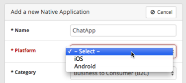

theme:appcelerator-training
tableclass:striped
progress:true

# Appcelerator Arrow

Appcelerator SDK Fundamentals

---cover

# Appcelerator Arrow

## Appcelerator SDK Fundamentals

--- 

# In this lesson, you will:

- Explore the features of and use-cases for Arrow Builder
- Explore the features and use-cases for Arrow Cloud

---section

# Arrow Overview

---

# What is Arrow?

An opinionated framework to build and deploy applications to the cloud.

- Arrow Builder lets you build and deploy API endpoints and node.js apps from localhost to cloud endpoints
- Arrow Cloud hosts applications, built with Arrow Builder

---

# Arrow Architecture Diagram


---

# Installation

- Step 1: Install Appcelerator CLI
	Visit: https://web.appcelerator.com/product/cli

- Step 2: Create an Arrow project
	`appc new`

- Step 3: run your Arrow project
 	`appc run`

---section

# Arrow Builder

---

# What is Arrow Builder

- Enables custom server-side functionality via Node.js
- Build and deploy API endpionts from structured data
- Create adapters to integrate external data sources
- Expose structured data with predefined API endpoints
- Write web applications using Arrow Web framework

---

# Arrow Builder Components

- Connectors are adaptors to external data sources
- Models are structured data generated API endpoints.
- APIs** are custom endpoints
- Blocks** are filters that allow you to pre- or post- process data
- Web framework for creating HTML applications.

---section

# Arrow Cloud

---

# What is Arrow Cloud?

- A pre-built Web backend for your apps
- Features 20+ pre-built APIs with easy Appcelerator integration
- Reliable & scaleable cloud-based solution
- SDKs available for Titanium, Objective C, Java/ Android, and REST
- Push Notification for iOS and Android

---

# Arrrow Cloud Components

- ArrowDB (formerly known as Appcelerator Cloud Services) pre-built REST objects and services.
- Arrow Push notification service for iOS and Android.


---

# Arrow Cloud APIs


---

# Deployment Options

- Can deploy app yourself, use Appcelerator Public Cloud Services, or create Virtual Private Cloud
- Public Cloud- scalable, completely managed by Appcelerator, no staff required
- Virtual Private Cloud – Dedicated enterprise MBaaS running on Amazon EC2 and monitored by AppC

---

# Public or VPC?

|   | Public Cloud (U.S.)  | VPC  |
|---|---|---|
| Dedicated infrastructure for data | No  | Yes  |
| Dedicated Dev/Test environments  | No  | Yes |
| Multi-region support  | No  | Yes |
| Disaster recovery  | Yes (Node redundancy)  | Yes (Node and Geo-redundancy)  |
| SLA  |  99.0% | 99.95%  |
| Security  |  Client SSL, Server SSL | Client SSL, Server SSL, (AES-256) file & DB encryption, VPN  |
| S/W Patching & Upgrading Scheduling  | No | Yes |
| Support Response Time  | Standard (8x5), Premier (24x7), Platinum (24x7) | Standard (8x5), Premier (24x7), Platinum (24x7) |

---section

# Using Arrow Cloud

---

# Enabling Arrow Cloud

1. Enable Platform Services in your App
2. Instantiate the `ti.cloud` library
3. Implement the ArrowDB APIs

---

# Register your app

**New Apps**


**Existing Apps**


---

# Registration results


- Creates a new ArrowDB application that you can manage using Appcelerator Dashboard.
- Adds the ti.cloud module to your tiapp.xml
- Adds application keys to tiapp.xml used to authenticate your application when making ArrowDB method calls.

---

# Native iOS/Android Apps

Dashboard -> Create new Native Application



Download iOS / Android SDK


---code

# Instantiate ti.cloud Library

```javascript
var Cloud = require('ti.cloud'); 
Cloud.debug = false; 
// set debug=true to see additional logging messages in the console 
```

---code

# Implement the Arrow Cloud APIs

```javascript
var login = function(username, password, callback) { 
     Cloud.Users.login({ 
	     login: username, 
	     password: password 
     }, function (e) { 
	     if (e.success) { 
		   currentUser = e.users[0]; 
		   loggedIn = true; 
		callback(loggedIn); 
		} else { 
			Ti.API.info('Error: ' + ((e.error && e.message) || JSON.stringify(e))); 
			loggedIn = false; 
			currentUser = null; 
		callback(loggedIn); 
		} 
     }); 
}; 
```

---

# Login Required

- (Almost) all ACS interactions must be done by logged in user
- Option 1: manually create ACS user & hard-code login in your app
- Option 2: prompt user to create account and log in
- By default, user sessions not preserved

---code

# Persisting User Session

```javascript
// In your createUser() type function, set 
// Ti.App.Properties.setString('sessionid', Cloud.sessionId); 

// when your app starts, restore the session 
var Cloud = require('ti.cloud'),
     sid = Ti.App.Properties.getString('sessionid'), 
     currentUser = null; 

if(sid) { 
     Cloud.sessionId = sid; // ← this is the critical piece 
     var me = Cloud.Users.showMe(function(e) { 
	   // extra: store local reference to user object 
	   currentUser = e.users[0]; 
     }); 
} 
```

---code

# Arrow Cloud in Alloy

Community contributed solution currently. See [https://github.com/aaronksaunders/ci.alloy.acs.books](https://github.com/aaronksaunders/ci.alloy.acs.books)

```javascript
exports.definition = { 
     config : { 
	  "columns" : { 
		"active" : "boolean" 
	  }, 
	  "defaults" : {}, 
 	  "adapter" : { 
		"type" : "acs", 
		"collection_name" : "books", 
		"custom" : true 
	  }, 
... 
```

---

# Management


---

# Analytics

- Log onto your [http://dashboard.appcelerator.com](http://dashboard.appcelerator.com) page
- Right-click Resources, choose **View Analytics**
- Visit [http://analytics.appcelerator.net/#app=YOUR_APP_GUID](http://analytics.appcelerator.net/#app=YOUR_APP_GUID)

---

# Arrow Cloud Docs


- [http://docs.appcelerator.com/cloud/latest/](http://docs.appcelerator.com/cloud/latest/)
- [http://docs.appcelerator.com/cloud/latest/#!/guide/acs_quickstart](http://docs.appcelerator.com/cloud/latest/#!/guide/acs_quickstart)
- [http://docs.appcelerator.com/cloud/latest/#!/api](http://docs.appcelerator.com/cloud/latest/#!/api)

---

# Arrow Cloud Kitchen Sink


- Example application provided with SDK
- Installed to SDK directory
- Not a full project; copy files to new project

---section

# Push Notification Basics

---

# Subscribing to Push Notifications

- For a push notification to reach a user, the user (or device) must be subscribed to receive push notifications on one or more notification channels

- The application must also obtain a device token, which permits ACS to communicate with the push service provider (Google Cloud Messaging or Apple Push Notification)

- To obtain a device token:

	1. On Android, call the Titanium.CloudPush module's retrieveDeviceToken() method.
	2. On iOS, call the Titanium.Network.registerForPushNotifications()

- Once your application has obtained a device token it should save it for later use.

---

# Titanium.CloudPush module's retrieveDeviceToken()

- To obtain a device token from GCM you first need to add the CloudPush module 
- Included with the Titanium SDK, but is not included by default in new projects
- To add the CloudPush module to your project:
	1. In Studio, open your project's `tiapp.xml` file.
	2. In the Modules section, click the add (+) button.
	3. Select `ti.cloudpush` and click OK.
- Require the `ti.cloudpush` module and call its `retrieveDeviceToken()` method
- Register event handlers to respond to success and error events
- Your application can listen for the callback event to process incoming push notifications
- Ensure application saves the device token for later use

---code

# Android Device Token and Event Handlers

**Step 1**

```javascript
// Require the module
var CloudPush = require('ti.cloudpush');
var deviceToken = null;
 
// Initialize the module
CloudPush.retrieveDeviceToken({
    success: deviceTokenSuccess,
    error: deviceTokenError
});
```

---code

# Android Device Token and Event Handlers

**Step 2**

```javascript
// Enable push notifications for this device
// Save the device token for subsequent API calls
function deviceTokenSuccess(e) {
    deviceToken = e.deviceToken;
}
function deviceTokenError(e) {
    alert('Failed to register for push notifications! ' + e.error);
}
 
// Process incoming push notifications
CloudPush.addEventListener('callback', function (evt) {
    alert("Notification received: " + evt.payload);
});

```

---

# Titanium.Network.registerForPushNotifications() 

- To obtain a device token on iOS, call the `Titanium.Network.registerForPushNotifications()` 
- Setup callbacks for the success, error, and callback events
- Specify the types of notifications enabled for your application, which can include:
	1. `NOTIFICATION_TYPE_ALERT`
	2. `NOTIFICATION_TYPE_BADGE`
	3. `NOTIFICATION_TYPE_NEWSSTAND`
	4. `NOTIFICATION_TYPE_SOUND`

---code

# iOS Device Token and Event Handlers

**Step 1**

```javascript
var deviceToken = null;

Ti.Network.registerForPushNotifications({
    // Specifies which notifications to receive
    types: [
        Ti.Network.NOTIFICATION_TYPE_BADGE,
        Ti.Network.NOTIFICATION_TYPE_ALERT,
        Ti.Network.NOTIFICATION_TYPE_SOUND
    ],
    success: deviceTokenSuccess,
    error: deviceTokenError,
    callback: receivePush
});
```

---

# iOS Device Token and Event Handlers

**Step 2**

```javascript
// Process incoming push notifications
function receivePush(e) {
    alert('Received push: ' + JSON.stringify(e));
}
// Save the device token for subsequent API calls
function deviceTokenSuccess(e) {
    deviceToken = e.deviceToken;
}

function deviceTokenError(e) {
    alert('Failed to register for push notifications! ' + e.error);
}
```

---section

#  Geo Fences

---

# Managing Geo Fences

Geo Fence associates a JSON data payload with a geographic location and a radius that defines the fenced region

Management Screen allows:

1. View
2. Create
3. Edit
4. Delete

---

# Managing Geo Fences


Geo Fence has the following unique fields:

1. Geo Coordinates – center of fenced region
2. Radius – A JSON data payload
3. Payload – A JSON data payload
4. Start Time – Date and time to start the geo-fence
5. End Time – Date and time to stop the geo-fence

---

# Creating Geo Fences

To create a Geo Fence object:

1. Click Create Geo Fence
2. For Location Type, select either Place or Geo Coordinates
3. For Place, click (+) and search/ select existing Place.  You can also Create a new Place.
	a: 
	b: For Geo Coordinates, enter the latitude and longitude
4. For Radius, enter distance in Miles or Meters.
5. For Payload, enter JSON-formatted string containing the data returned if the geo-fence area intersects the device’s location
6. Start Time and End Time fields defines the active period. (All times are UTC)
	- For Start Time, select the date, hour and minute
	- For End Time, select the date, hour and minute
7. Click Save Changes

---

# GeoFences API

Overview
	(1) Please note only available for Platform Subscribers
	(2) GeoFences API allows management of spatial objects
	(3) The device should query the ACS server to retrieve data based on a location
	(4) Please refer to PushNotifications to send location based push notifications
Parameters
	(1) Datetime fields – use ISO 8601 format, YYYY-MM-DDTHH:mm:ss+ZZZZ
	(2) Coordinates – specified as arrays with longitude first and latitude second [longitude, latitude]
	(3) Distance – specified in radians. 
		(a) Calculated by dividing the distance by the approximate circumference of the Earth.
Fields
	(1) created_at : Date – date when created
	(2) end_time : Date – date of expiration
	(3) id : String – generated ID for this geo-fence
	(4) loc : Hash – JSON-encoded object for the geo-fence perimeter, specified as a circle  with a center point of either place_id or coordinates property and the radius		
		(a) place_id (String): Use an ACS Places object as the center of the circle. Specify the ID of the Place
		(b) coordinates (Array): Center coordinate of the circle. Specify a point as [longitude,latitude]
		(c) radius (Number/String): Radius of the bounding circle in radians. To calculate the distance in radians, divide the distance you want by the approximate circumference of the Earth in the same units. For example, 10 miles is 10 / 3959 or 2 kilometers is 2 / 6371. Specify the fraction as a string, for example, "10/3959" or "2/6371“
	(5) payload : Hash – JSON-encoded data to retrieve when device intersects the geo-fence
	(6) start_time : Date – Datetime when to start the geo-fence
	(7) update_at : Date – Date when the geo-fence was updated

---

# Create Geo-Fence API

POST geo_fences/create.json
	(1) Create a geo-fence object with an optional start and end time
	(2) Available only for Platform Subscribers
	(3) User Login Required: Yes

Parameters
	(1) geo_fence : Hash REQUIRED – JSON object describing the geographic perimeter, data payload, and start and end time for the geo-fence object.
		(a) loc (Hash): Required - Geographic perimeter. See loc above.
		(b) payload (Hash): Required - JSON-encoded data to retrieve if a device intersects the geographic perimeter
		(c) start_time (Date): Datetime to start the geo-fence
		(d) end_time (Date): Datetime to end the geo-fence

Response Parameters
	(1) geo_fences : GeoFences[] - Single-element array containing the newly-created geo-fence object

---

# POST geo_fences/create.json

> **IMPORTANT:** Requires Titanium SDK 3.2.1 or later.

The following example creates a geo-fence covering a ten-mile area with San Francisco, CA, USA as the center point:

```javascript
Cloud.GeoFences.create({
    geo_fence: {
        "loc":{"coordinates":[-122.4167,37.7833], "radius":"10/3959"},
        "payload":{"alert":"24-hour sale at our SF flagship store on 12/26!"},
        "start_time": "2014-03-08T00:00",
        "end_time":"2014-12-26T19:00"
    }
}, function (e) {
    if (e.success) {
        Ti.API.info(JSON.stringify(e.geo_fences));
    } else {
        alert('Error:\n' +
            ((e.error && e.message) || JSON.stringify(e)));
    }
});

```
---

# Other Useful API Calls for Managing GeoFences

- **DELETE** `geo_fences/delete.json`
  1. Deletes an existing geo-fence object
  2. **Available only for Platform Subscribers**
  3. **User Login Required: Yes**
- **Parameters**
  - id : String **REQUIRED** – ID of the geo-fence object

---

# DELETE geo_fences/delete.json

> **IMPORTANT:** Requires Titanium SDK 3.2.1 or later.

```javascript
Cloud.GeoFences.remove({
    id: geoFenceId
}, function (e) {
    if (e.success) {
        Ti.API.info(JSON.stringify(e));
    } else {
        alert('Error:\n' +
            ((e.error && e.message) || JSON.stringify(e)));
    }
});
```

---

# Other Useful API Calls for Managing GeoFences

GET geo_fences/query.json
	(1) Perform custom query of geofences with sorting and paginating
	(2) Available for Platform Subscribers only
	(3) For details about using the query parameters, see the Search and Query guide.
Parameters
	(1) page : Number – Request page number, default is 1
	(2) per_page : Number – Number of results per page, default is 10
	(3) limit : Number – maximum umber of records to fetch, cannot be greater than 1000
	(4) response_json_depth : Number – Default value is 3, Valid range is 1 to 8. 
	(5) skip : Number – Number of records to skip, must be used with limit
	(6) where : Hash - A JSON-encoded object that defines the query used. If blank, all objects are returned
		(a) start_time
		(b) end_time
		(c) loc : For this property, specify a MongoDB Geospatial Query.
Response Parameters
	(1) geo_fences : GeoFences[] – List of matching geo-fences

---

# GET geo_fences/query.json

> **IMPORTANT:** Requires Titanium SDK 3.2.1 or later.

This example searches for geo-fences within 2 km of Oakland, CA, USA:

```javascript
Cloud.GeoFences.query({
    where:{
        "loc": {
            "$nearSphere" : {
                "$geometry" : { "type" : "Point", "coordinates" : [-122.2708,37.8044] },
                    "$maxDistance" : 2000
                }
            }
    }
}, function (e) {
    if (e.success) {
        Ti.API.info(JSON.stringify(e.geo_fences));
    } else {
        alert('Error:\n' +
            ((e.error && e.message) || JSON.stringify(e)));
    }
});
```

---

# POST geo_fences/update.json

> **IMPORTANT:** Requires Titanium SDK 3.2.1 or later.

```javascript
Cloud.GeoFences.update({
    id: geoFenceId
    geo_fence:{"loc":{"place_id":"531a1217447d300f05003b69","radius":"2/6371"}}
}, function (e) {
    if (e.success) {
        Ti.API.info(JSON.stringify(e.geo_fences));
    } else {
        alert('Error:\n' +
            ((e.error && e.message) || JSON.stringify(e)));
    }
});
```

---

# Summary

In this lesson, you:

- Explored the features and use-cases for Arrow Cloud
- Enabled Arrow Cloud support in an app and implement Arrow Cloud APIs

---section

# Questions?