theme:appcelerator-training
tableclass:striped
progress:true

# Deployment

Appcelerator SDK Fundamentals

---cover

# Deployment

## Appcelerator SDK Fundamentals

--- 

# In this lesson, you will:

- Deploy an Android app to a device for testing
- Deploy an iOS app to a device for testing
- Determine your options for deploying to remote testers

---section

# ANDROID DEPLOYMENT

--- 

# Android Deployment Steps:

- Configure your device for testing
- Build & deploy

--- 

# 1. Configure Device

- Windows/Linux: Install or configure drivers
- Use the proper USB cable (not a charge-only cable)
- Enable the connection on the device
- Jelly Bean: Accept the connection
- Use the right connection mode

--- 

# 1a. Enable Connection on the Device

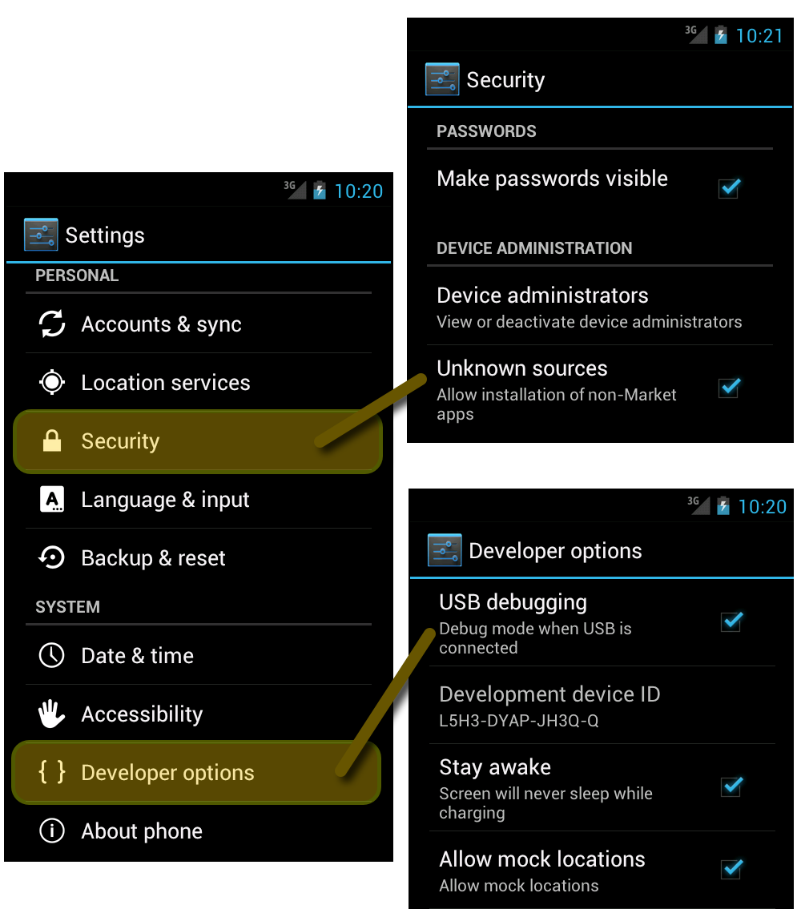

- Enable Developer Settings and allow for unknown sources
- Turn on USB Debugging
- Android 4.2+: Enable developer settings:
	- About Phone/Tablet
	- Tap on build number seven times.
	- Return to Settings screen

--- 

# 2. Local Android deployment

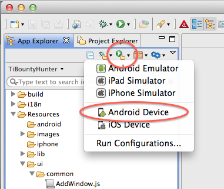

- Connect device to USB port
- From Run menu, choose Android Device

--- 

# 2a. ADB Sometimes Hangs

You may need to invoke `adb kill-server` to force `adb` to restart.

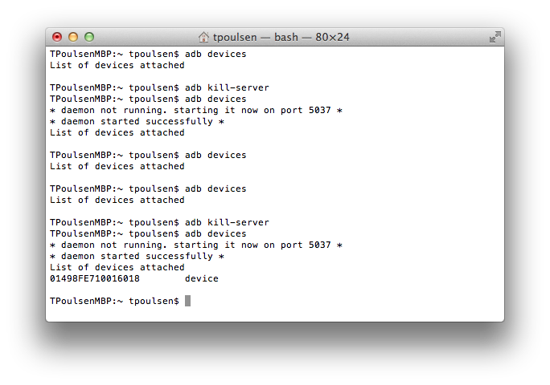

--- 

# 2. Remote Android deployment

Simple: Get the APK to the user's device

- Email
- Post on a web site (e.g. Dropbox)
- Distribution framework

---section 

# iOS Deployment For Testing

--- 

# iOS Deployment Steps:

1. Register for Apple's Developer program
2. Create a developer certificate
3. Register your devices
4. Create an app ID
5. Create a provisioning profile
6. Install the provisioning profile
7. Build & install

--- 

# 1. Apple Developer Program

- Download & install Xcode from the App Store
- Register for Apple Developer program
- Pay Apple's annual fee
- Apple offers Individual, Company, Enterprise, & University programs
--- 

# 2. Developer's certificate

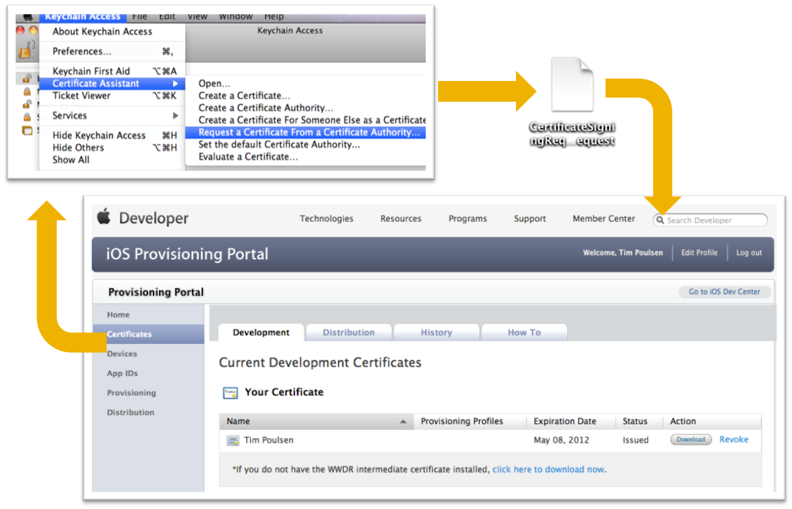

--- 

# 3. Register devices

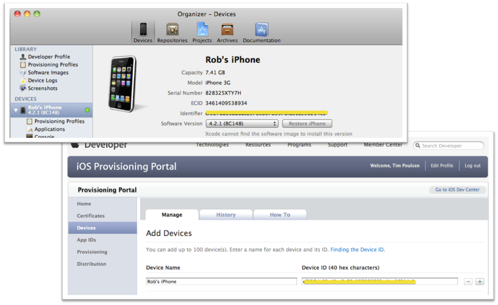

--- 

# 4. Create an AppID

- Unique identifier for your app
- Bundle Seed ID - 10 character universally unique
- CF Bundle Identifier - app name or wildcard
- Bundle Identifier must be unique for Push, In-App purchases, Game Center
--- 

# 5. Provisioning profile

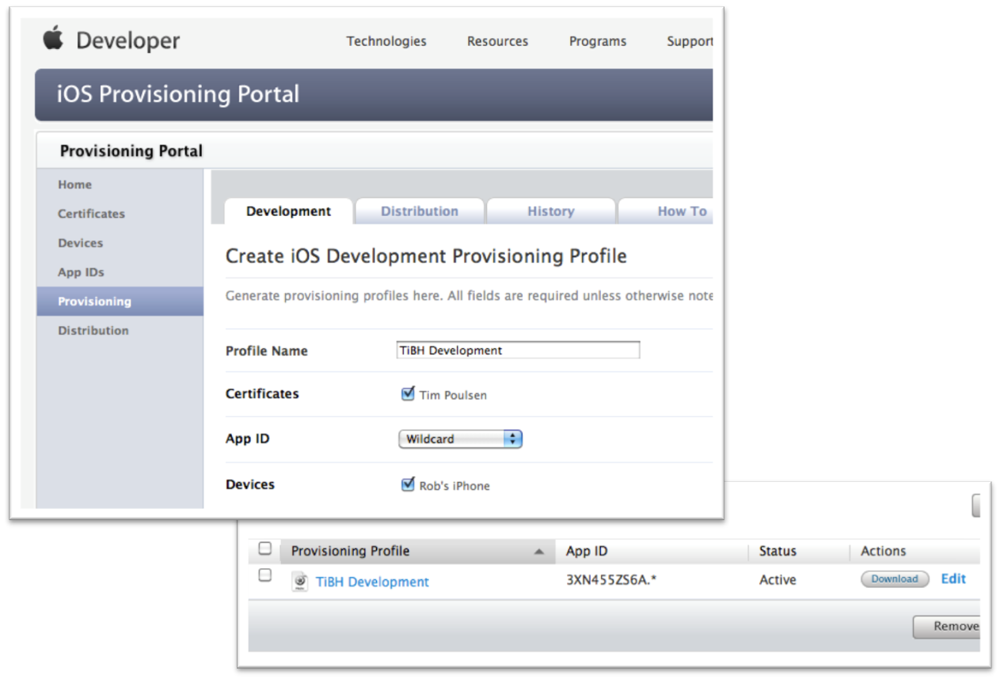

--- 

# 6. Install the provisioning profile

Option 1: Drag & Drop to Xcode

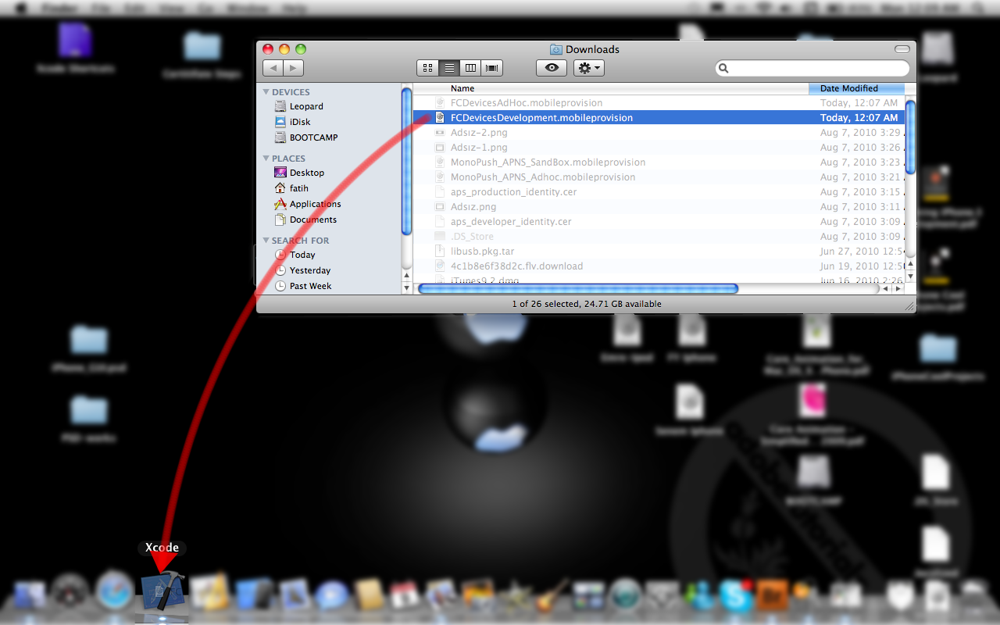

--- 

# 6. Install the provisioning profile

Option 2: Install w/ Titanium Studio

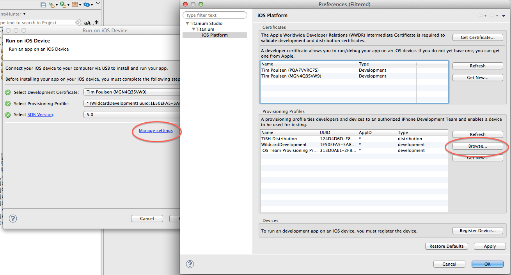

--- 

# 7. Installing to local test device

- Connect via USB
- Choose iOS Device from Run menu
- Install IPA using Xcode or iTunes sync

--- 

# 7. Distributing to remote testers

Email `.mobileprovision` file and IPA

Over-the-air distribution systems:

- TestFlight Beta Testing
- Diawi
- AppSendr
- HockeyKit

---section

# Getting Started With Cloud Test

--- 

# Automated Testing - Features

- Provided by SOASTA TouchTest mobile
- Functional Testing with non-jailbroken iOS & Android devices
- Allows full gesture support
- Appcelerator Test Agent must open before recording/playback
- Full integration with CI systems for full automated testing cycles

--- 

# Automated Testing - Requirements

- TouchTest Agent
- iOS Device & Simulators
	- [http://appctest-2.appcelerator.com/concerto/touchtest](http://appctest-2.appcelerator.com/concerto/touchtest)
- Android device (2.3.3+) & Emulators (2.3.5+)
	- [http://appctest-2.appcelerator.com/concerto/touchtest](http://appctest-2.appcelerator.com/concerto/touchtest)
	- Login and download APK
- Devices need network access to Appcelerator Platform servers
- Administrator needs to approve device/simulator

---section 

# Testing - Starting

--- 

# Automated Testing - Starting

Devices or Simulator registration

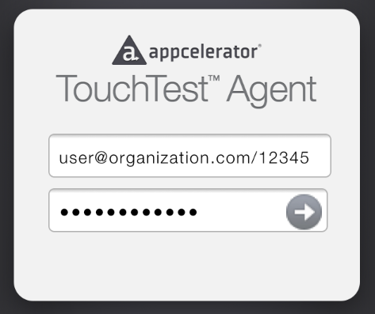
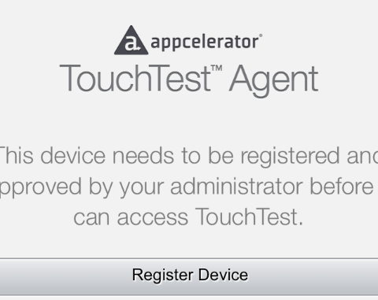
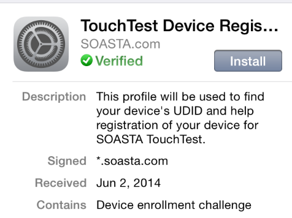
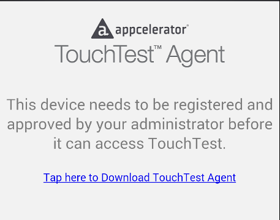
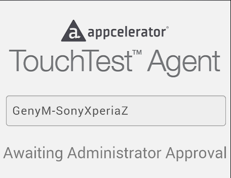
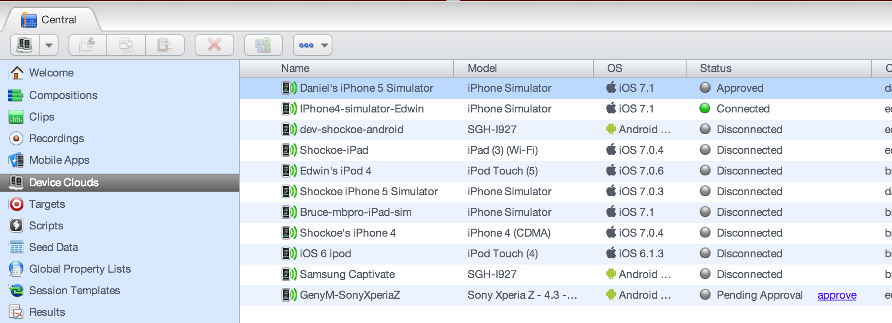

--- 

# Try It

- Open Browser on Simulator or device
- Navigate to TouchTest Agent
- Register simulator/device

--- 

# Automated Testing - Starting

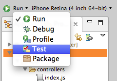
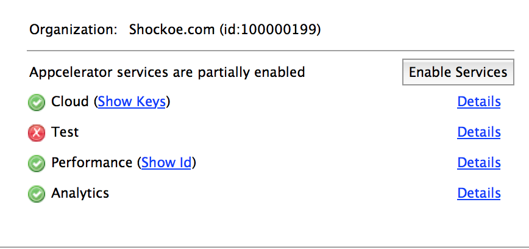

- Enable Services from `tiapp.xml`
- In Studio: Select TEST > device or simulator

---section

# Recording A Test Clip

--- 

# Automated Testing – Recording a Test Clip

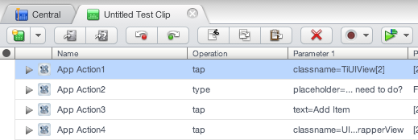

- Clip: Basic building block of a test.
- App actions: taps, gestures, test inputs
- Start a test clip from the Dashboard

--- 

# Automated Testing – Recording a Test Clip

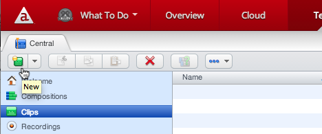
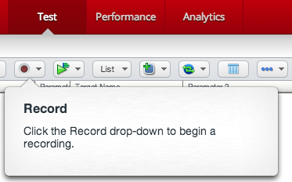

- Make sure TouchTest Agent is connected to Test Service
- Go to the Appcelerator Dashboard – Test tab
- On the Central tab, select Clips then click on NEW
	- A new Clip Editor will open
- Click Record and select Record Mobile app

--- 

# Try It

- Connect TouchTest agent
- From Dashboard create a new Clip
- Record some actions and save Clip

--- 

# Automated Testing – Test Composition

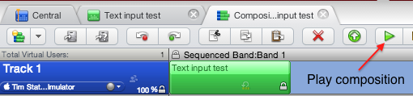

- It’s the actual test that will be executed on the device
- Consist of one or more clips arranged in tracks
- Organize tracks to create full regression tests
- Select devices per-track or per-clip

--- 

# Try It

- Record multiple clips
- Add  clips to a composition
- Add multiple tracks and multiple devices

--- 

# Summary

In this lesson, you:

- Learned how to deploy an Android app to a device for testing
- Learned how to deploy an iOS app to a device for testing
- Explored options for deploying to remote testers
- Recorded an Appcelerator Automated test clip

---section

# Questions?