theme:appcelerator-training
tableclass:striped
progress:true

# Distribution

Appcelerator SDK Fundamentals

---cover

# Distribution

## Appcelerator SDK Fundamentals

--- 

# In this lesson, you will:

- Learn the steps for publishing to the Android Market
- Learn the steps for publishing to the AppStore
- Compare options for AdHoc, Enterprise, and private distribution of iOS apps

---section

# ANDROID PUBLISHING

--- 

# Targeting Android Versions

minSdkVersion - minimum version supported
targetSdkVersion - target version also determines which version of the Android build tools are used
Controls Play Store filtering
tool-api-level no longer supported or needed

```xml
<android xmlns:android="http://schemas.android.com/apk/res/android">
     <manifest android:installLocation="auto"> 
	   <uses-sdk android:minSdkVersion="14" 
		android:targetSdkVersion="16"/> 
     </manifest> 
</android> 
```

--- 

# Google Play

(formerly the Android Market)

- Set up your account and meet the Play (Market) requirements
- Build and sign your code
- Gather required assets
- Upload to Play

--- 

# Google Play requirements

- Google account
- Android Developer account
- One-time fee
- SDK tools: keytool, jarsigner, zipalign

--- 

# Generate Key Pair and Certificate

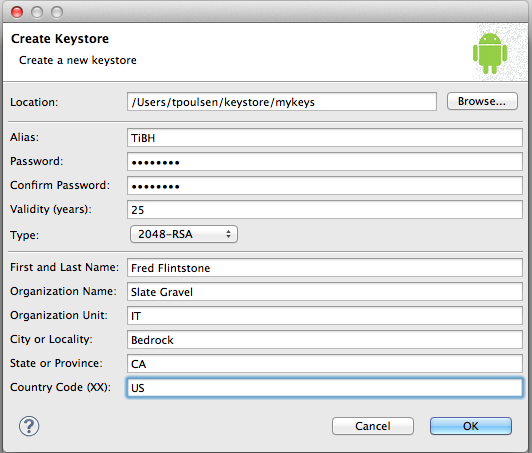

--- 

# Verify Keystore

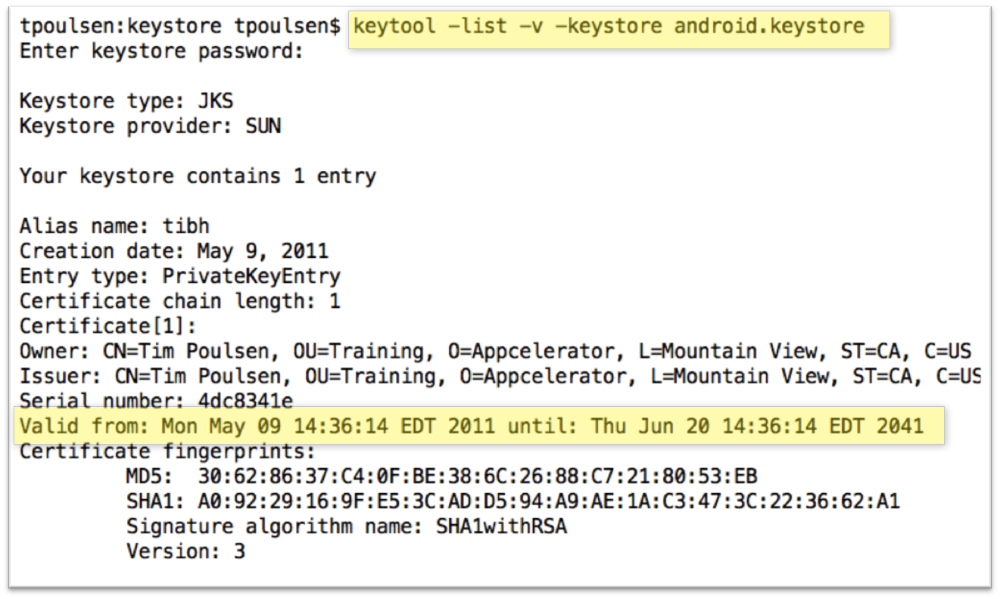

--- 

# Sign Your Application

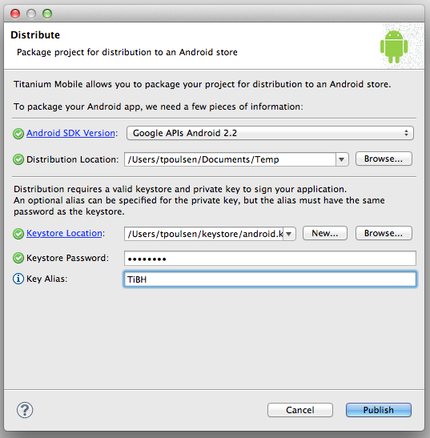

--- 

# Verify Signed App

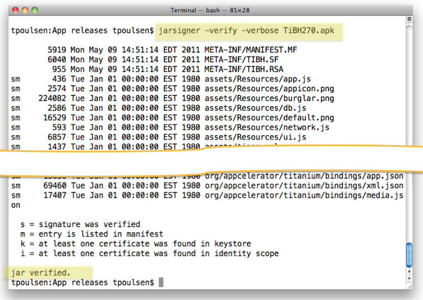

--- 

# Uploading and publishing

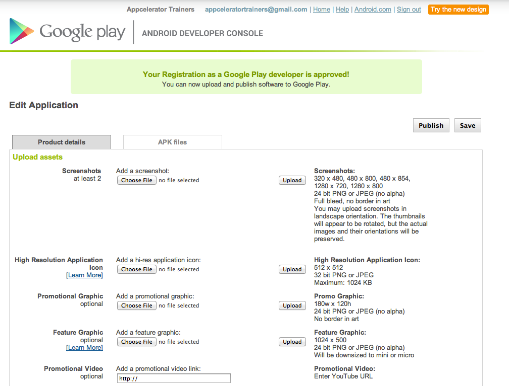

- Two screenshots
- 512x512 px icon
- Title, description
- Type, Category
- Content rating
- Price, countries
- Contact info
- Code-signed APK file

---section 

# iOS PUBLISHING

--- 

# iTunes Appstore

1. Gather required assets
2. Obtain distribution certificate and provisioning profile
3. Install certificate and provisioning profile
4. Build and code-sign app
5. Create app entry at iTunes Connect
6. Verify and upload to iTunes Connect from Xcode Organizer

--- 

# Required Assets in your App

> **TIP:** All of these must be present in your IPA file. Apple will check.

- App icons for all supported devices and resolutions
- Extra icons (for Settings app, Spotlight, etc.)
- Launch images (splash screens) for all supported devices, resolutions, and orientations
- iTunesArtwork (512px square) and iTunesArtwork@2x (1024px square) icons for iTunes

See [http://goo.gl/eXZ0t](http://goo.gl/eXZ0t) for complete list

--- 

# Certificate

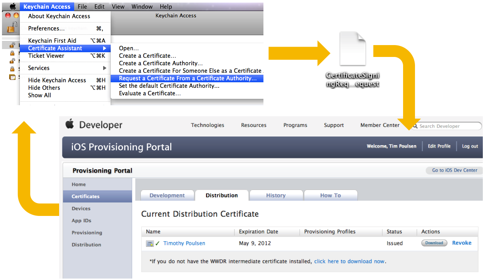

--- 

# Distribution Provisioning Profile

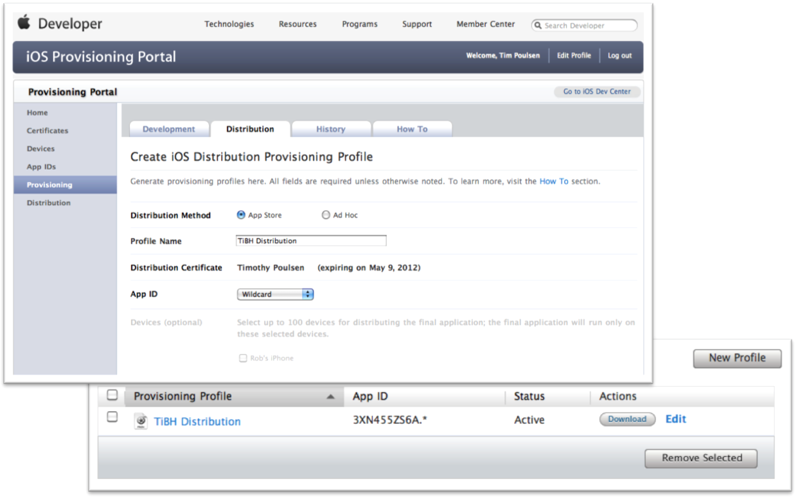

--- 

# Build for Distribution

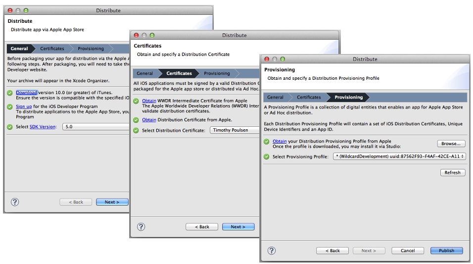

--- 

# iTunes Connect

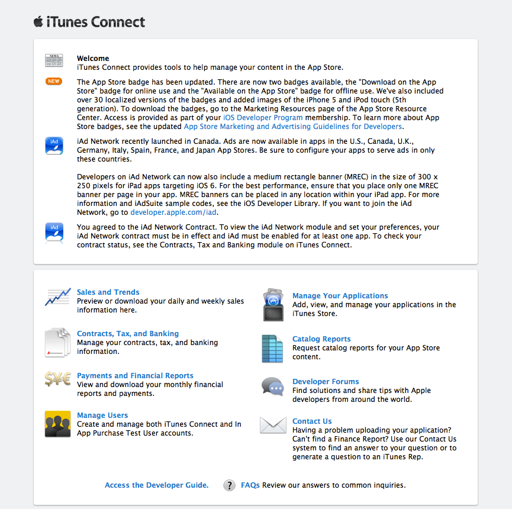

- Portal for app sales management
- Sales statistics
- Contracts, taxes, payments, banking connections
- Need app entry here to publish

--- 

# Creating an app in iTunes Connect

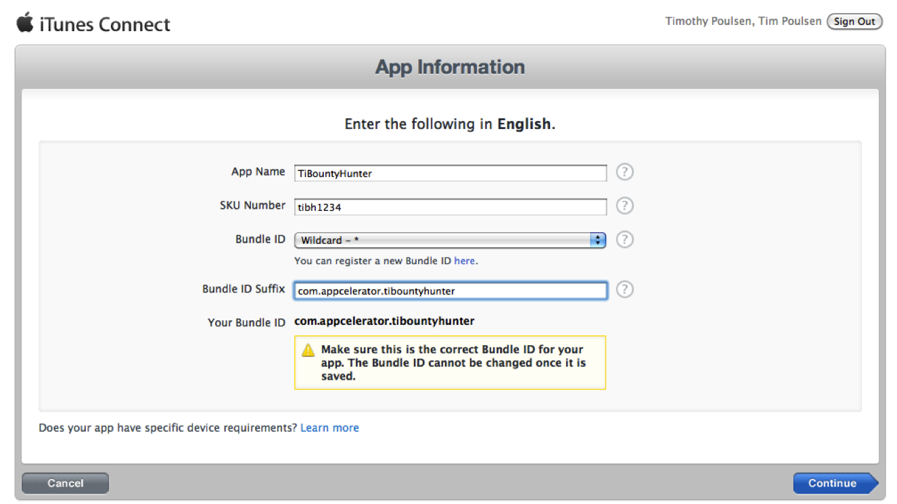

- 1 screen shot per device per language
- 1024x1024 px icon
- Title, description, keywords
- Primary Category
- Content rating
- Price tier, countries
- Contact info, support URL

--- 

# Validating and Uploading

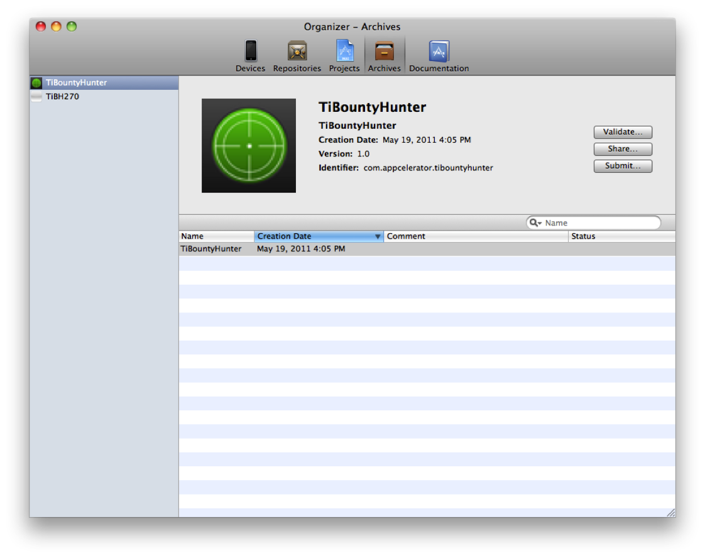

--- 

# App Store Review Requirements

- Many requirements - see iOS Dev Center for full details
- Must be useful, well-designed, run without errors
- No downloading code
- You must own trademarks
- No hidden features, use of non-public APIs

--- 

# Ad Hoc Distribution

- Distribute outside of App Store (e.g. TestFlight)
- Limited to running on your registered devices
- Ad Hoc builds expire after 90 days
- Deploy by email, over-the-air framework, USB install

--- 

# Enterprise Distribution

- In-house distribution program
- Distribute to employees or members
- Register as company or organization, DUNS number required

--- 

# University Subscription

- Accredited (degree-granting) institutions only
- Meant for students & teachers to use during classes & labs
- Free
- Can actually publish free apps with a University license

--- 

# Summary

In this lesson, you:

- Learned the steps for publishing to the Android Market
- Learned the steps for publishing to the AppStore
- Compared options for AdHoc, Enterprise, and private distribution of iOS apps

---section

# Questions?