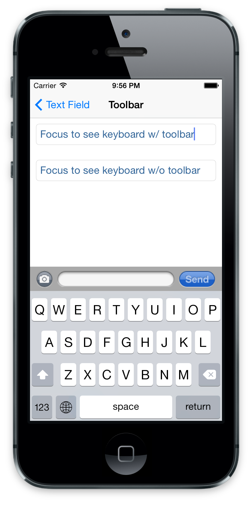

theme:appcelerator-training
tableclass:striped
progress:true

# iOS Deep Dive

Appcelerator SDK Fundamentals

---cover

# iOS Deep Dive

## Appcelerator SDK Fundamentals

--- 

# In this lesson, you will:

- Explore iOS Platform Characteristics
- Explore Key UI and non-UI APIs

---section

# PLATFORM CHARACTERISTICS

---

# Platform Characteristics

- All controls are on the display, no hardware buttons
- Device orientation support
- Responds to taps and gestures
- One app at the time
- An app has a single window

--- 

# iOS "Flat" Design

- Reduced bevels, shadows, rounding
- Reduced textures, bitmaps &emdash; no more woodgrain or leather
- Depth (and context) provided by layering, subtle shadows, parallax and 3D effects
- Brighter & lighter design &emdash; brighter colors, thinner fonts, line-art iconography

--- 

# Windows "Extend" to Fill the Screen


--- 

# View Shadows & Clipping


```javascript
"#box":{
	backgroundColor:"blue",
	height:50,width:200,
	top:20,
	viewShadowColor: "red",
	viewShadowOffset: {x:3,y:3},
	viewShadowRadius: 3
	//Clipping child View
	clipMode:Ti.UI.iOS.CLIP_MODE_ENABLED
},
"#clipped":{
	height:35,width:300,
	backgroundColor:"yellow"
}

```

--- 

# CoreMotion

- Access to Apple’s CoreMotion APIs
- Need to install the CoreMotion module
- Only works on a device
- APIs available:
- Device Motion: Device’s altitude and acceleration
- Activity: Motion-related activity the user is doing  automotive, walking, stationary)
- Step Counter : Track how many steps a user takes

--- 

# Try It

- Add a views with shadow
- Add a child view and enable clipping

---section

# KEY UI APIS

--- 

# Top-Level Containers

Don’t add these to views:

- Titanium.UI.Window
- Titanium.UI.iPad.SplitWindow
- Titanium.UI.iOS.NavigationWindow
- Titanium.UI.TabGroup

--- 

# Non-Container Views

Don’t use these as containers:
- ActivityIndicator
- Button
- ImageView
- Label
- ProgressBar
- SearchBar
- Slider
- Switch
- TableView
- TextArea
- TextField
- WebView

--- 

# NavigationWindow

Is a top-level container (don't put it in a window)
Windows within a NavigationWindow have a NavigationBar (title bar)
Add/remove new windows with openWindow() and closeWindow()

```xml

<!-- Titanium.UI.iOS.NavigationWindow --> 
<Alloy> 
  <NavigationWindow id="navwin" platform="ios"> 
    <Window id="win"> 
      <View id="box"/> 
    </Window> 
  </NavigationWindow> 
</Alloy> 
```

```javascript
// in associated controller, add a second window 
var newWin = Alloy.createController('newWin'); 
$.navwin.openWindow(newWin.getView()); 
```

--- 

# NavigationBar

Present in tab groups and NavigationWindows
Modal windows have them, but without nav buttons
String, image, or View in center
Left/Right nav buttons for in-app navigation

```xml
<Alloy> 
  <NavigationWindow> 
    <Window> 
      <LeftNavButton> 
    	  <Button>Base UI</Button> 
      </LeftNavButton> 
      <TitleControl> 
    	  <ImageView image="/images/skull.png"/> 
      </TitleControl>
    </Window> 
  </NavigationWindow> 
</Alloy> 
```

--- 

# Toolbars



- Buttons perform actions related to current context
- Create button objects first, store in an array
- Pass the array to the Toolbar object
- Aim for 44 x 44 point hit area for buttons


```xml
<Window id="win">
    <Toolbar platform="ios"> 
      <Items> 
	       <Button id="camera"/> 
	       <FlexSpace/> 
	       <TextField id="tf"/> 
	       <FlexSpace/> 
	       <Button id="send"/> 
       </Items> 
    </Toolbar>
</Window>
```

--- 

# Keyboard Toolbars


```xml
<Alloy>
  <TextField id=”myTextField” >
    <KeyboardToolbar platform="ios” borderTop="true" borderBottom="false">
	    <Items>
	      <Button id="camera" systemButton="Ti.UI.iPhone.SystemButton.CAMERA" />
	      <FlexSpace/>
	      <TextField id="tf" />
	      <FlexSpace />
        <Button id="send" title="send"/>
      </Items>
    </KeyboardToolbar >
  </TextField >
</Alloy>
```

--- 

# Button Bar


```xml
<ButtonBar platform="ios" onClick="doSomething"> 
  <Labels> 
  	<!-- Specify text with node text or "title" attribute. --> 
  	<Label>One</Label> 
  	<Label title="Two"/> 
  	<Label title="Three"/> 
  	<Label title="Four"/> 
  	<Label title="Five"/> 
  </Labels> 
</ButtonBar> 
```

--- 

# Tabbed Bar

> **TIP:** Buttons maintain selected state!

```xml
<TabbedBar platform="ios" onClick="doSomething"> 
  <Labels> 
	<!-- Specify text with node text or "title" attribute. --> 
	<Label>One</Label> 
	<Label title="Two"/> 
	<Label title="Three"/> 
     </Labels> 
</TabbedBar> 

// in the controller 
function doSomething(e){ 
     switch(e.index) { 
          case 0: 
	// do stuff 
          break; 
     } 
}); 
```

--- 

# Attributed Strings

Apply fonts and styles to ranges of characters in a Label, TextArea or TextField 


--- 

# Dynamic Type (textStyle)


--- 

# Tab Badge

Communicates status to the user, their attention is needed in part of the app


```javascript
var tab = Ti.UI.currentTab; 
tab.badge = 10; // set the badge 
tab.badge = null; // to remove it 
```

--- 

# App Badge


```javascript
Ti.UI.iPhone.appBadge = 14; 
Ti.UI.iPhone.appBadge = null; 
```

--- 

# CoverFlow View


```xml
<Alloy>
    <Window id="window">
        <CoverFlowView platform="ios" backgroundColor="#000”>
            <!-- The Images tag sets the CoverFlowView.images property. -->
            <Images>
                <!-- Assign the image by node text or the image attribute. -->
                <!-- Can also specify the width and height attributes. -->
                <Image>a.png</Image>
                <Image>b.png</Image>
                <Image>c.png</Image>
            </Images>
        </CoverFlowView>
    </Window>
</Alloy>
```

--- 

# Dashboard View


- Springboard-like view
- Use as app home screen
- User can rearrange or remove icons (if you enable it)
- Scrolling container
--- 

# Dashboard View

```xml
<Window> 
     <RightButton> 
	     <Button id="editButton" onClick="toggleEditMode">Edit</Button> 
	   </RightButton> 
     <DashboardView id="dash" onEdit="handleEdit"> 
	   <DashboardItem image="acct_off.png" selectedImage="acct_on.png" label="account"/> 
	   <DashboardItem image="calls_off.png" selectedImage="calls_on.png" label="calls"/> 
	   <DashboardItem image="cases_off.png" selectedImage="cases_on.png" label="cases"/> 
	   <DashboardItem image="tasks_off.png" selectedImage="tasks_on.png" label="tasks"/> 
     </DashboardView> 
</Window> 
```

```javascript
// in the controller 
function toggleEditMode(e) { 
     isEditable ? $.dash.stopEditing() : $.dash.startEditing(); 
} 
```

--- 

# AdView

- Include ads in your app
- Banner or full screen
- Must join Apple's iAd program
- Get test ads only during development


```javascript
var iad = Ti.UI.iOS.createAdView({ 
     width: Ti.UI.FILL, 
     height: Ti.UI.SIZE, 
     adSize: Ti.UI.iOS.AD_SIZE_PORTRAIT, 
     bottom: -100 
}); 
iad.addEventListener('load', function(){ 
     iad.animate({ 
	bottom: 0, 
	duration: 500 
     }); 
}); 
iad.addEventListener('action', function(){ 
     mygame.pause(); // do something when ad is clicked 
}); 
$.win.add(iad); 
```

# FUNCTIONALITY APIS

--- 

# Background Services

- Runs when the application is placed in the background
- Extend runtime for limited duration (~10min)
- OS might terminate it when resources are needed
- Use for Long-running geolocation or music playback

`somefile.js`

```javascript
Ti.API.info('Registering background services');
var service = Ti.App.iOS.registerBackgroundService({
    url:'bg-service.js'
});
```

`bg-service.js`

```javascript
var count = Ti.App.Properties.getInt('bg-svc-count', 0);
count++;
Ti.App.Properties.setInt('bg-svc-count', count);
Ti.API.info('bg-service2 has been run ' + count + ' times');

```
--- 

# Background Networking

- APIs to support iOS (background) network activity
- Download large files using `UrlSession`
- Perform actions when the app is awoken to perform background downloads by listening for the `backgroundfetch` event
- Requires an add-on (though included) module, `com.appcelerator.urlSession`
- See the iOS [Background Services](http://docs.appcelerator.com/titanium/latest/#!/guide/iOS_Background_Services) guide for all the details

--- 

# Try It

- Register a background service
- Count the number of time the service has been started

--- 

# Local Notifications

- Runs on device, not push
- Scheduled action
- Background service alert the user

```javascript
// schedule the notification 
Titanium.App.iOS.scheduleLocalNotification({ 
     alertBody:"View Alarm", 
     alertAction:"You set an alarm", 
     userInfo:{data: 'Data to pass'}, 
     date:new Date(new Date().getTime() + 3000) 
}); 
// listen for the notification 
Ti.App.iOS.addEventListener('notification', 
     function(e) { 
     	Ti.API.info('Local notification received: ' + e.data); 
}); 
```

--- 

# Try It

- Register a local notification

--- 

# Network APIs

- Ti.Network.BonjourBrowser
- Ti.Network.BonjourService
- Socket
- Cookie
- HttpClient
- TCPSocket

--- 

# Implementing Application Preferences

1. Create a Settings Bundle
2. Access settings as properties with Ti.App.Properties
3. Do clean-build of your project


**Creating the Settings Bundle**

1. Copy KitchenSink/platform/iphone to your project
2. In Finder, right-click Settings.bundle and choose Show Package Contents
3. Open Root.plist
4. Edit as necessary, then save

---section

# KEY UI APIS – iPad only

--- 

# SplitWindow


- Full-screen, two-pane view
- Left pane fixed at 320 points
- User cannot resize panes

--- 

# Key APIs - Titanium.UI.iPad.SplitWindow

```xml
<Alloy> 
  <SplitWindow platform="ios" formFactor="tablet"> 
	   <!-- The 'masterView' window --> 
	   <Window id="master"> 	
		   <Label>This is the master</Label> 
	   </Window> 

	   <!-- The 'detailView' window --> 
	   <Window id="detail"> 
       <Label>This is the detail</Label> 
	   </Window> 
  </SplitWindow> 
</Alloy>
```

--- 

# PopOver

- Transient view revealed by tap on control
- Hovers over app content

```xml
<Popover title="Inbox"> 
  <ContentView> 
	  <NavigationWindow>
  	  <LeftNavButton id="mobileMe"/>
  	  <RightNavButton id="edit"/> 
  	  <Window> 
  		  <TableView id="tbl"/> 
  	  </Window> 
  	</NavigationWindow> 
  </ContentView> 
</Popover> 
```

```javascript
// view property controls where the arrow points 

var pop = Alloy.createController('popover').getView(); 
pop.show({view:$.button});
```

---

# Summary

In this lesson, you:

- Explored iOS Platform Characteristics
- Explored Key UI and non-UI APIs

---section

# Questions?