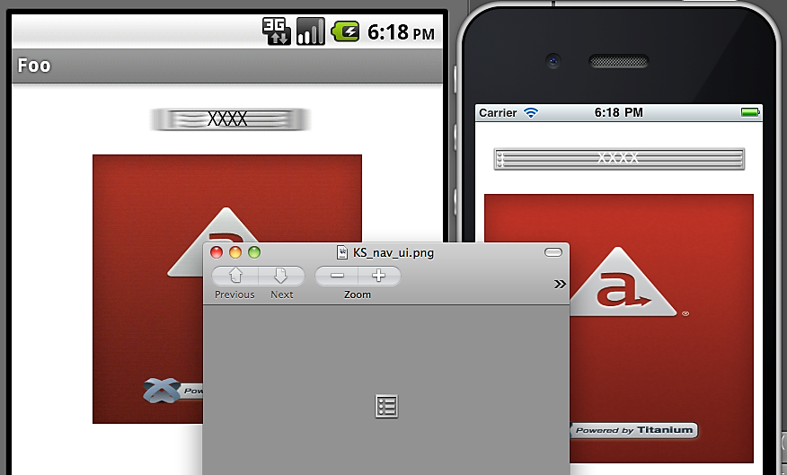
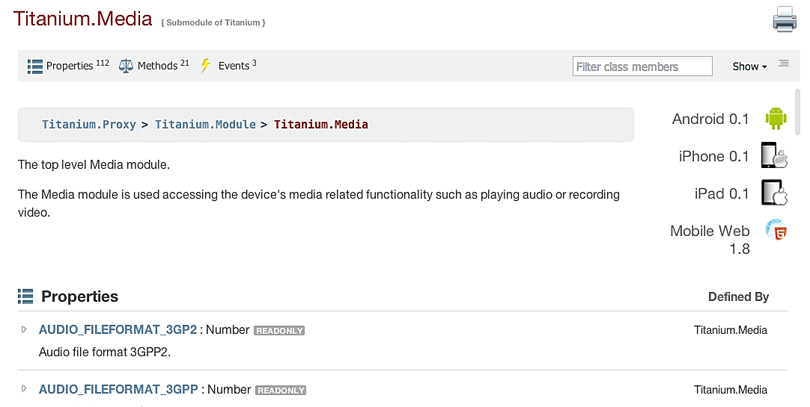

theme:appcelerator-training

# Multimedia

Appcelerator SDK Fundamentals

---cover

# Multimedia

## Appcelerator SDK Fundamentals

--- 

# In this lesson, you will:

- Explore Titanium Media APIs
- Leverage media in your application

---section

# STILL IMAGES AND BACKGROUNDS

--- 

# Still Image APIs

- Display using ImageView or backgroundImage
- Can either be local or remote
- Can be an array of images to create animations

```xml
<Alloy> 
     <ImageView id='localImage'/> 
     <ImageView id='remoteImage'/> 
     <View id='aTitaniumView'/> 
</Alloy> 
```

```javascript
'#localImage': { 
     image: 'images/myimage.png' 
     /* myimage@2x used on iOS if avail & retina */ 
}, 
'#remoteImage': { 
     image: 'http://foo.com/myimage.png', 
     defaultImage: 'images/loading.png' 
}, 
'#aTitaniumView': { 
     backgroundImage: '/images/bg.png', 
     height: 100, width: 100 
} 
```

--- 

# Background Scaling



- Background stretched/squeezed to fit
- On iOS, left/right cap not stretched.. or top/bottom cap
- On Android, use draw9patch

---section 

# AUDIO

--- 

# Sound

```javascript
// with <Button id="play"></Button> 

// in controller: 
$.play.addEventListener('click', function() { 
     var sound = Titanium.Media.createSound({ 
	url: 'cricket.wav' // could be http url too! 
     }); 
     sound.play(); 
}); 
```

--- 

# Recording (iOS)

```
// with <Button id="record"></Button> 

// in controller: 
var recorder = Ti.Media.createAudioRecorder({ 
     	compression: Ti.Media.AUDIO_FORMAT_ULAW, 
	format: Ti.Media.AUDIO_FILEFORMAT_WAVE 
}); 

$.record.addEventListener('click', function() { 
     recorder.start(); 
     Ti.Media.startMicrophoneMonitor(); 
}); 
```

--- 

# Streaming Audio

```javascript
// with <AudioPlayer id="player"/> and <Button id='playbtn'/> 

// in the controller: 
$.player.url = 'http://www.example.com/podcast.mp3'; 
$.playbtn.addEventListener('click', function() { 
     $.player.start(); 
}); 

$.win.addEventListener('close', function() { 
     $.player.stop(); // stop playback when window closes! 
}); 
```

---section 

# VIDEO

--- 

# VideoPlayer

Streaming support: HTTP Live Streaming (iOS), RTSP (Android), pseudo-streaming

```javascript
// with <VideoPlayer id="player"/> and <Button id='playbtn'/> 

// in the controller: 
$.player.url = 'movie.mp4'; // http url would work too! 

// set player control style 
$.player.movieControlStyle = Titanium.Media.VIDEO_CONTROL_EMBEDDED; 
$.playbtn.addEventListener('click', function() { 
     $.player.start(); 
}); 

$.win.addEventListener('close', function() { 
     $.player.stop(); // stop playback when window closes! 
});
```

--- 

# Video Events
- load : Video file has finished loading
- complete : Video has finished playing, e.reason on event object will tell you why
- fullscreen  : Video player has changed to or from fullscreen mode

---section 

# CAPTURING IMAGES

--- 

# From the Gallery

```javascript
$.galleryButton.addEventListener('click', function() { 
     var options = { 
	  success: function(e) { 
     		// fired when user selects from gallery 
		// e.media == the image data 
	  }, 
	  cancel: function() { 
		// fired when user cancels 
	  }, 
	  error: function(error) { 
		// fired when there's an error 
		// error.code is a constant, like Titanium.Media.NO_CAMERA 
	  }, 
	  allowEditing: true, 
	  mediaTypes: [Ti.Media.MEDIA_TYPE_PHOTO] 
     } 
     Ti.Media.openPhotoGallery(options); 
}); 
```

--- 

# From the Camera

```javascript
$.galleryButton.addEventListener('click', function() { 
     var options = { 
	success: function(e) { 
	     // fired when user selects from gallery 
	     // e.media == the image data 
	}, 
	cancel: function() { 
	     // fired when user cancels 
	}, 
	error: function(error) { 
	     // fired when there's an error 
	     // error.code is a constant, like Titanium.Media.NO_CAMERA 
	}, 
	saveToPhotoGallery: true, 
	mediaTypes: [Ti.Media.MEDIA_TYPE_PHOTO, Ti.Media.MEDIA_TYPE_VIDEO]
     } 
     Ti.Media.showCamera(options); 
}); 
```

--- 

# Ti.Media



- Media constants
- Helper properties (e.g. isCameraSupport)
- Helpful methods (e.g. beep(), vibrate(), etc.)

--- 

# Demo - Saving images to the gallery

- Open gallery in simulator, then close it
- Find images using simulator's web browser (e.g. Google Images search)
- Press and hold on image
- Choose Save image

--- 

# Summary

In this lesson, you:

- Explored Titanium Media APIs
- Leveraged media in your application

---section

# Questions?