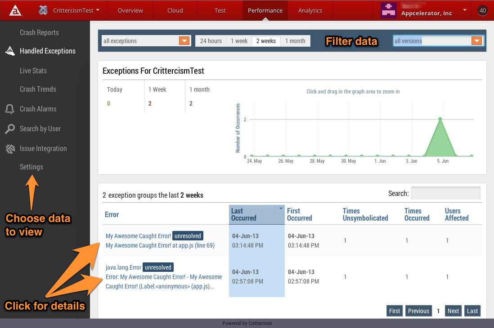
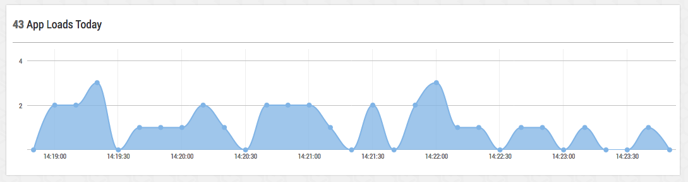
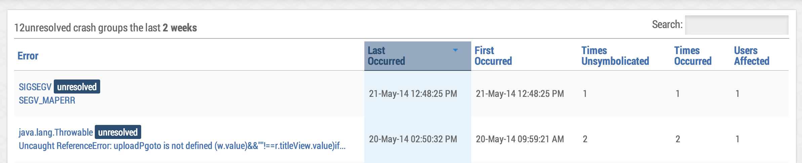
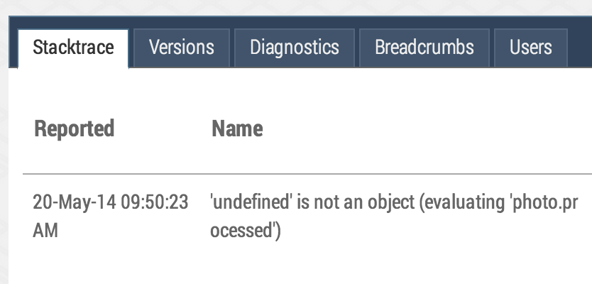
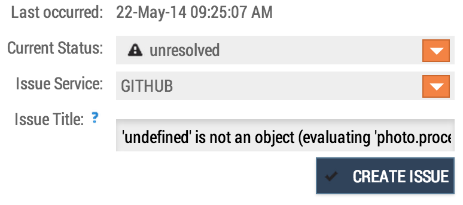
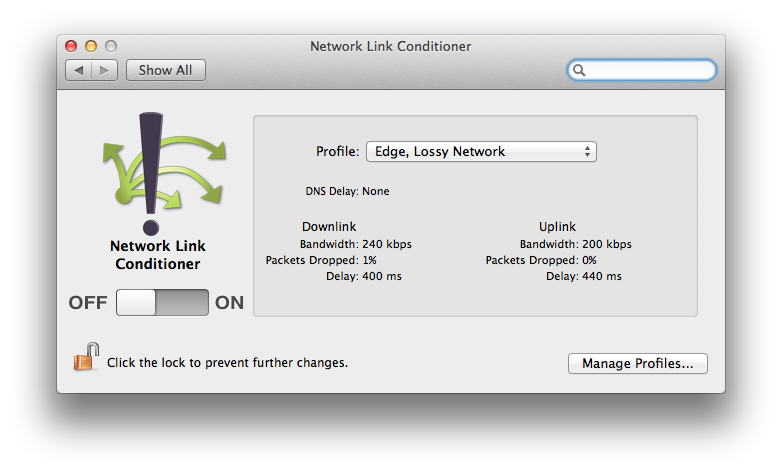
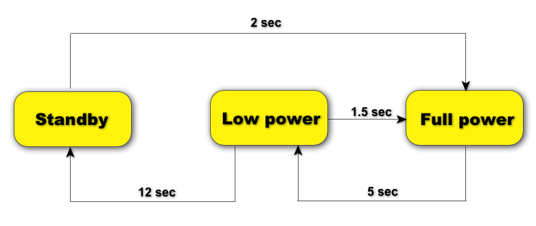
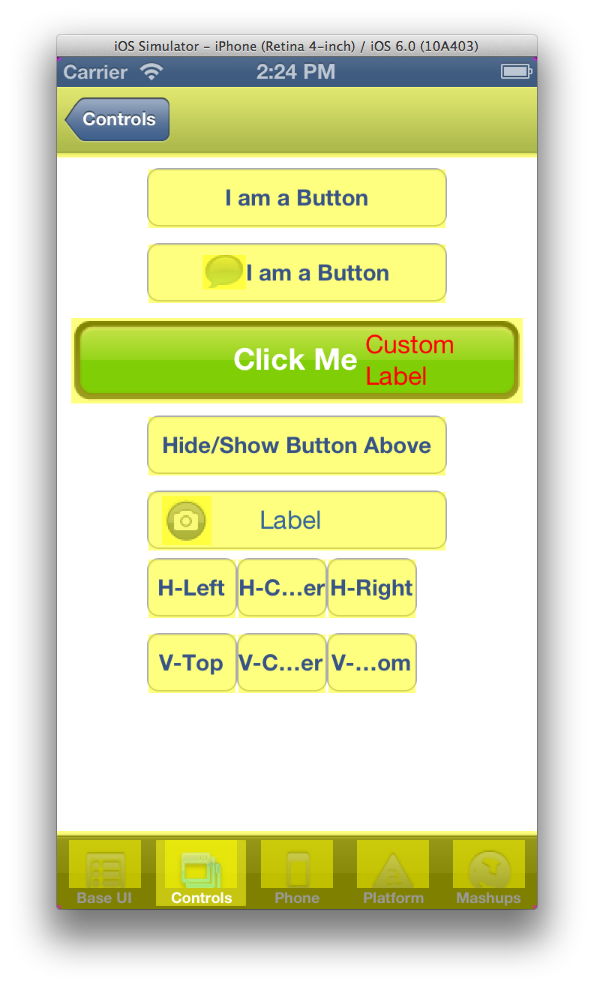

theme:appcelerator-training
tableclass:striped
progress:true

# Performance Optimization

Appcelerator SDK Fundamentals

---cover

# Performance Optimization

## Appcelerator SDK Fundamentals

---

# In this lesson, you will:

- Explore Appcelerator Platform performance tools
- Manage and profile memory in an Appcelerator app
- Identify performance best practices

---section

# APPCELERATOR PERFORMANCE MANAGEMENT

---

# Appcelerator Performance Tools

- Appcelerator includes several powerful tools to help you monitor and improve your app’s performance
- Application Performance Management (APM), uses Crittercism technology tightly integrated with Appcelerator to monitor app health, crashes and performance
- Studio includes the Code Profiler, which can be used to isolate slow calls and methods

---

# Appcelerator Performance Dashboard



---

# Monitor Real-Time Performance

Live Stats – updates every 15 seconds



---

# Troubleshooting

**Crash Reports & Error Handling**



- Ordered by most recent (sortable)
- Can filter by status (known, unresolved, resolved)
- Can filter by time (last 24 hours, 1 week, 2 weeks, 1 month)
- Can filter by app version number


---

# Troubleshooting




- Crash Reports & Exception Handling
  - Click on error for detailed report (stacktrace, versions, diagnostics, breadcrumbs, users)
    - Can change status of ticket from this screen
    - Can also leave notes for your team

---

# Basics of Using APM

- Make sure that your app is configured to use Appcelerator Cloud Services
- Leave breadcrumbs in your app!
  - Use the leaveBreadcrumb method to add them to code
  - Place around transitions to make it easier to track events leading to a crash
  - Append variables to get more data

---

# Try It

- Open dashboard and go to the application with performance enabled
- Check live stats and report of crashes
- Check how to connect to a Jira System
- Check code to leave BreadCrumbs and see them in the report.

---section

# MEMORY MANAGEMENT

---

# Memory Limitations

Computation is usually not the bottleneck, RAM is

|iOS|Android|
|-|-|
|iPhone ~12 MB|Froyo/Gingerbread (2.2/2.3) - 24 MB|
|iPad ~30-50 MB|ICS - 24 MB|
||ICS w/ "large heap" - 128 MB|

> **NOTE:** Apple does not publish information about their app termination threshold.

---

# Managing Memory

- Understand JavaScript garbage collection
- Understand native-layer memory deallocation
- Write high-quality code
- Profile your app

---

# JavaScript Garbage Collection

- Automatic (no manual allocation/deallocation)
- 'Mark and Sweep' stops execution periodically & briefly
- Interpreter decides when and how
- Objects collected when no references remain
- Nothing in the global space is ever collected!
- "Force" collection by encapsulating within functions or modules that will go out of scope
- Or, set variables to null

---

# Titanium Native Layer

Object collected/nulled in JS signals native to deallocate

```javascript
$.win.close(); // ← its children can be collected 
$.imageview = null; // ← native proxy can be deallocated (function() { 
     var win = Ti.UI.createWindow(); 
     win.open(); // ← when user closes this window, it will be collected 
})(); 

```

---

# Avoiding Memory Leaks

- Don't store variables in the global scope
- Set objects = null when no longer needed
- Watch for "hidden" references in functions, closures, event listeners, accidental global assignments

---

# Limit Images

- Images are bitmap in memory
- No compression in memory
- File format doesn't matter
- Lazy load images — when you need them
- Then unload / destroy images you no longer need them

For example:

A 200 by 200 px image..

= 40,000 pixels x 32 bits per pixel 
= 1,280,000 bits 
= 160,000 Bytes 
= 156.25 KB 
= ~1/6th MB 

---

# Demo: Profiling an App

- iOS: Use Instruments — either Allocations or Leaks
- Android: Use Monitor (more difficult)

---section

# PERFORMANCE TIPS

---

# Code Profiler is Your Friend

- Code profiler is vital for improving the performance of your app
- Use it to identify calls that are taking too long to process and/or using too many system resources
- Design tests which cover crucial sections

---

# JavaScript Loading Tips

- Defer loading a script until it is actually needed
- Use **`require()`** to capitalize on caching
- Avoid **`Ti.include()`**, remember **`eval()`** is "evil“
- Use Alloy's conditionals, e.g. `IS_IOS`, `IS_ANDROID`

---

# JavaScript Optimizations

Avoid trips across the bridge!

```javascript
var table = Ti.UI.createTableView(); 
var data = []; 
for(var i = 0; i < 10000; i++){ 
     	data.push( 
		Ti.UI.createTableViewRow({ 
			title:'Row #'+i, 
			selectionStyle: Ti.UI.iPhone.TableViewCellSelectionStyle.BLUE 
		}); 
	); 
} 
table.setData(data); 

```

---

# JavaScript Optimizations

Avoid trips across the bridge!

```javascript
var table = Ti.UI.createTableView(); 
var data = []; 
for(var i = 0; i < 10000; i++){ 
    	// generic object references can be faster 
	data.push({ 
		title:'Row #'+i, 
		selectionStyle: Ti.UI.iPhone.TableViewCellSelectionStyle.BLUE 
	}); 
} 
table.setData(data); 
```

---

# JavaScript Optimizations

Avoid trips across the bridge!

```javascript
var table = Ti.UI.createTableView(); 
var data = []; 
// create local references to Ti properties 
var SEL_STYLE_BLUE = Ti.UI.iPhone.TableViewCellSelectionStyle.BLUE; 
for(var i = 0; i < 10000; i++){ 
	data.push({ 
		title:'Row #'+i, 
		selectionStyle: SEL_STYLE_BLUE 
	}); 
} 
table.setData(data); 
```

References:

- https://gist.github.com/2989311 
- https://gist.github.com/3056032

---

# Database Performance

- SQL Queries are fast - use these rather than in-memory sorting of JS arrays, etc.
- Wrap multiple inserts in a transaction
- Avoid loading Blobs into memory — don't store in database
- Open/close connections with each use
- SQLite Optimization FAQ - http://j.mp/HFxVZ8

---

# Database Performance

- SQL Queries are fast - use these rather than in-memory sorting of JS arrays, etc.
- Wrap multiple inserts in a transaction
- Avoid loading Blobs into memory — don't store in database
- Open/close connections with each use
- SQLite Optimization FAQ - http://j.mp/HFxVZ8

---

# Network Performance

- Don't assume WiFi — test on cell networks
  - OS X: Network Link Conditioner
  - Windows: Monitor/DDMS
  - Field testing best
- Decrease service payload sizes
- ... but make as few requests as possible
- Use JSON as transportset up server-side proxy for SOAP/XML services



---

# Installing Network Link Conditioner

- Open Xcode
- Choose Xcode > Open Developer Tool > More Developer Tools
- Download **Hardware IO Tools for Xcode**
- Double-click **Network Link Conditioner.prefpane**

---

# Battery Optimization



- Critical on Android, important on iOS too
- Network and geolocation most critical concerns

More info at:

- Android — [http://j.mp/IDMk5H](http://j.mp/IDMk5H)
- iOS — [http://j.mp/IDMaeG](http://j.mp/IDMaeG)

---

# UI Optimization

- Avoid compositing operations: transparency, rounded corners, gradients, drop shadows
- Set a BG color to match parent container — default is transparent
- Avoid multiple layout passes: Ti.UI.SIZE/FILL or '80%‘
- Position at integer coordinates, e.g.$.view.top = Math.round(calculatedPosition)
- Use correctly sized images to limit runtime scaling

---

# Viewing Inefficiencies in iOS Simulator



- Debug > Color Blended Layersshows transparent/blended layers
- Debug > Color Misaligned ImagesMagenta means subpixel misalignments, yellow means stretched/scaled images

---

# Summary

In this lesson, you:

- Explored Appcelerator’s Performance management tools
- Managed and profile memory in an Appcelerator app
- Identified performance best practices

---section

# Questions?