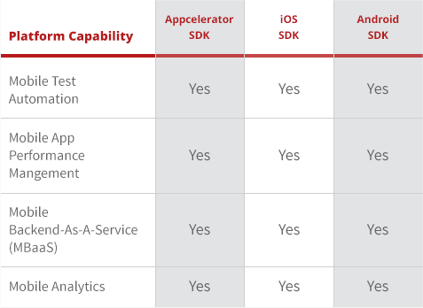
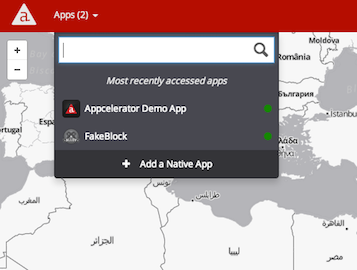
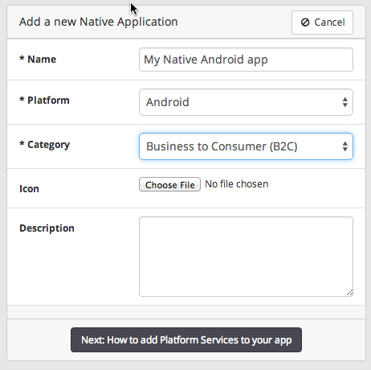
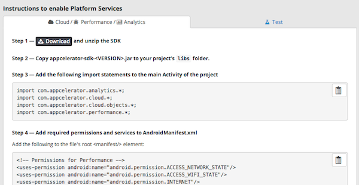
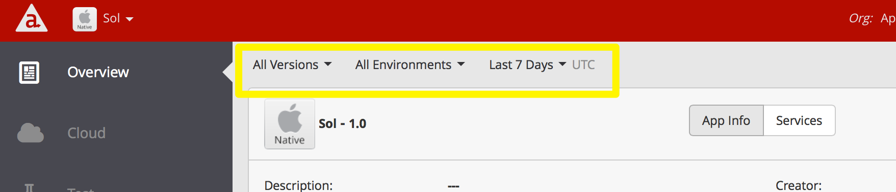
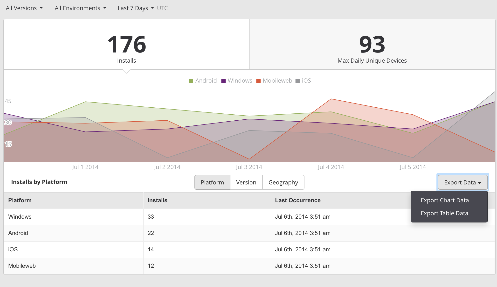

theme:appcelerator-training
tableclass:striped
progress:true

# Appcelerator Platform

Appcelerator SDK Fundamentals

---cover

# Appcelerator Platform

## Appcelerator SDK Fundamentals

--- 

# In this lesson, you will:

- Learn how to manage organizations
- Learn how to import native applications on to the Platform
- Identify how to filter and export data

---section 

# Working with the dashboard

--- 

# Managing Organizations

- View details of the organizations
- Manage applications created by other members of the organization
- Admins can create apps, invite users to join the organization and assign members to application teams
- Members can create apps only
- A User, can have different access rights
  - Dashboard, Insights, Node.ACS
- A User, can be part of multiple organizations

--- 

# Try It

- View organization details , applications and members
- Add an organization member
- View and add application team members
- Delete an application
- Modify a member’s role or access
- Create new organization (if you have access)

---section 

# Native Applications

--- 

# Managing Native Apps

All Platform services now can be used with legacy applications developed with a native SDK (iOS/Android)

--- 

# Adding Native Apps

- Provide a name, platform, a category
- Appcelerator services will be enabled
- Download different SDKs for each service you want to integrate

--- 

# Try It

- Create a native app
- Review all the steps to integrate with a native SDK project

---section 

# Working with data

--- 

# Data Filters

- Filter data by App version number, environment, or time period
- User can select a filter options
- The data in the dashboard page will be updated based on set filters

--- 

# Export Data

Two Options to Export chart and table data to CSV format:

1. Export Chart Data to export the data in the chart
2. Export Table Data to export the data in the table

--- 

# Summary

In this lesson, you...

- Identified how to manage organizations 
- How to manage/add native applications 
- Identified how to export data

---section

# Questions?