theme:appcelerator-training
tableclass:striped
progress:true

# Appcelerator Development Basics

Appcelerator SDK Fundamentals

---cover

# Appcelerator Development Basics

## Appcelerator SDK Fundamentals

---section

# Working with Studio

--- 

# In this lesson, you will:

- Set up the tools and SDKs needed for Appcelerator development
- Create and configure a mobile project
- Build and run a project in the simulator/emulator


- Do something
- Cool on the year of time
- Then walk a plank

--- 

# Appcelerator Studio

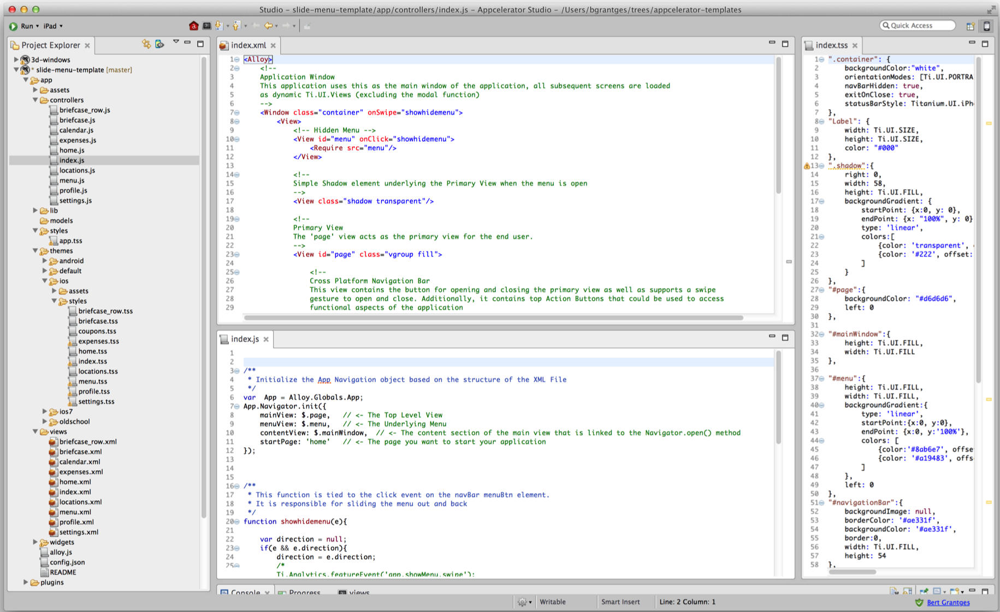

--- 

# Appcelerator Studio

- Appcelerator Studio is an Eclipse-based integrated development environment (IDE)
- Available for Mac, Windows and Linux
- Helps installing and configuring Native SDKs that required for all platforms
- Create and setup mobile, web and node applications
- Enterprise features
  - Platform services
  - Code analyzer
  - Code profiler
  - LiveView

--- 

# Appcelerator Studio - Features

- Platform Configuration Wizard
- Syntax checking and visual aids to detect problems with your code.
- Debugging
- Code Profiler & Analyzer
- Git integration
- Package and Publish to App Stores or Enterprise stores
- Integration with Genymotion

--- 

# Studio Setup

- Runs on OS X, Windows, and Linux
- Dashboard will help you through SDK setup steps.
- Configure SDK locations:
  - Click “Get started”
- Make sure to set a default Android SDK... and choose a Google APIs version!

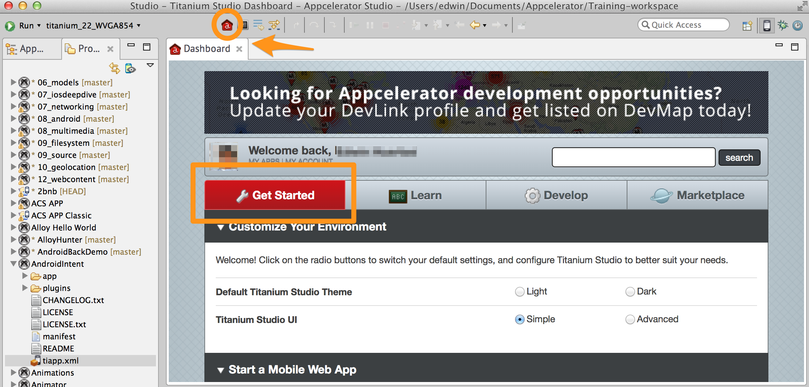
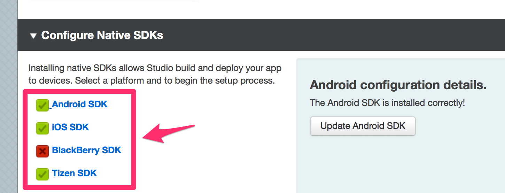

--- 

# SDKs and Requirements

- Native SDKs are required
- Android
  - Oracle JDK
  - Android SDK (ADK)
  - Download platform & tool sets
  - Path and Environment settings
- iOS
  - Xcode
  - A Mac! (Intel-based)


- BB10
  - Oracle JDK
  - BlackBerry NDK
  - VMWare Fusion for emulator
- Windows 8
  - Visual Studio 2013
  - VmWare Fusion (mac)

--- 

# Android SDK Files

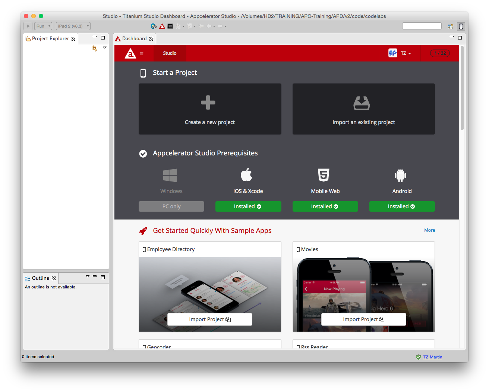
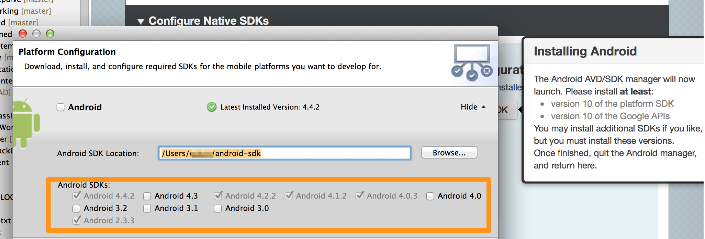

- **Studio will download for you**
- Use native tool / run android SDK manager
- Download, then unzip them

--- 

# Android Platforms

> **TIP:** Studio will not do this; you should do so periodically.

- ```android``` script
- Download SDK Platform and Google APIs
- You must use Google APIs version with your apps
- Current mix at: [http://developer.android.com/](http://developer.android.com/about/dashboards)

--- 

# Path & Environment

**Optional, but really handy**

- OS X
  - Edit ```~/.bash_profile``` (hidden, might not exist)
  - Add path to tools and platform-tools folders to your PATH
  - Restart terminal

- Windows
  - Edit System Properties in Control Panel
  - Set PATH to both tools and platform-tools directories
  - Make sure you've also set the JDK's path and JAVAHOME variables

--- 

# iOS: Xcode

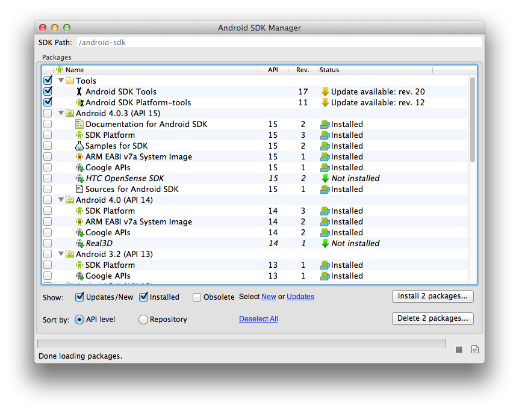

- Not much setup
- Download from Apple App Store and install

--- 

# iOS: Handy Tools

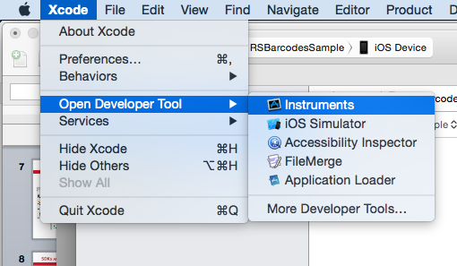
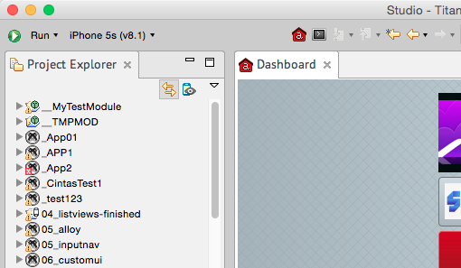

- iOS simulator
- Instruments

--- 

# Enterprise Tools - LiveView

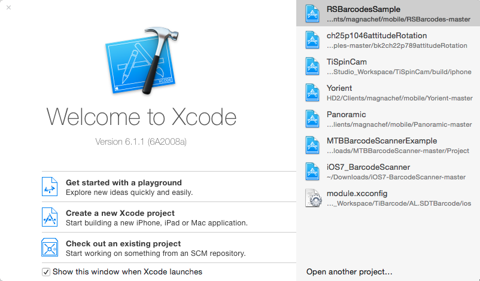

- LiveView displays updates of your application as you develop it
- Designed to help with UI design
- Saving time – no need to build your project after a simple change.
- For Major changes: adding new files or functionality. Try re-building from time to time.

--- 

# Enterprise Tools - Code Analyzer

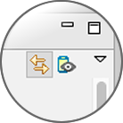

- Code Analyzer will analyze your code to identify errors and areas for improvement
- Uses the Titanium Code Processor
- Not all errors will be mapped to the files in App folder
- Helps to make sure you are using the correct APIs for the platforms you are deploying to.
- Finds code with deprecated APIs

--- 

# Enterprise Tools - Code Profiler

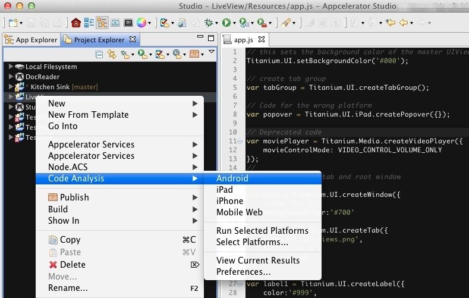

- Code Profiler collects detailed performance data
- Use by launching Profiler session, then “Capture performance profile”
- Records each method called and how long it took to execute

--- 

# Enterprise Tools – Mobile Apps Distribution

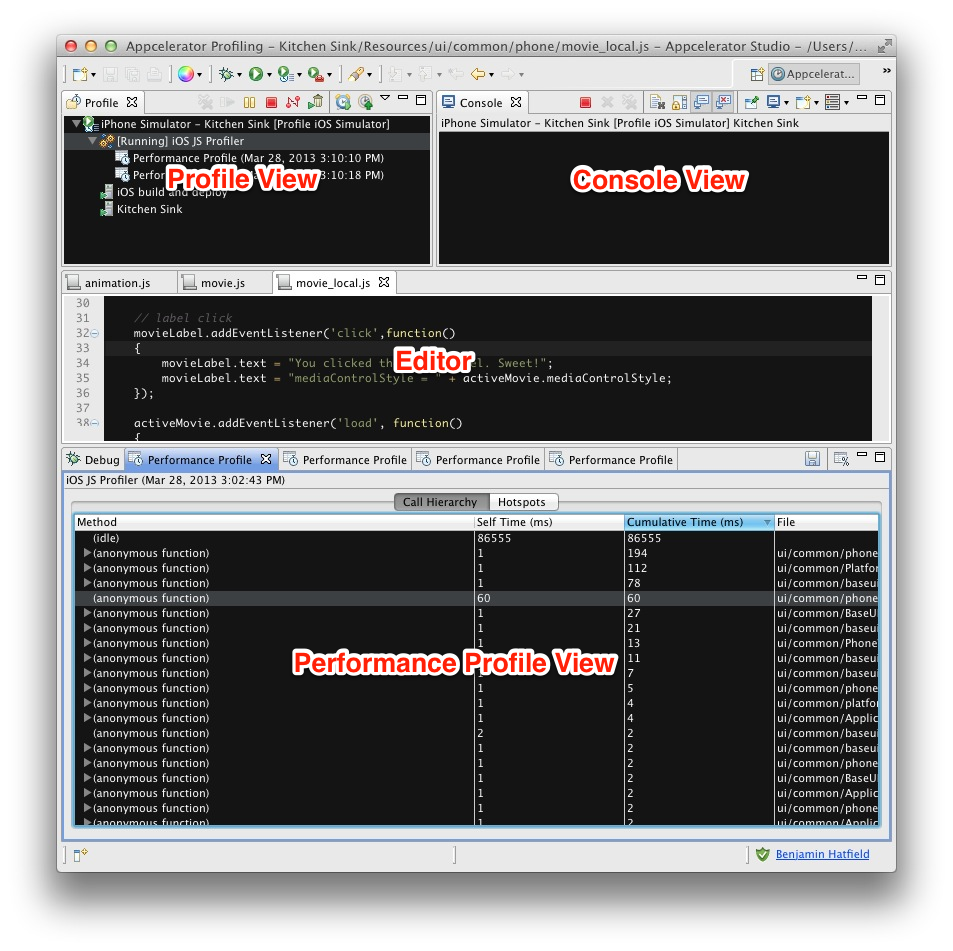

- Appcelerator Studio allows you to package Android and iOS applications and upload them to a Mobile Application Management platform
- Needs a plugin to work with your Distribution Platform (MobileIron, etc)

--- 

# Try It

- Create Shortcuts for iOS Simulator and Xcode
- Create terminal paths for Android SDK

---sectin

# Creating and Configuring Projects

--- 

# Creating a Project


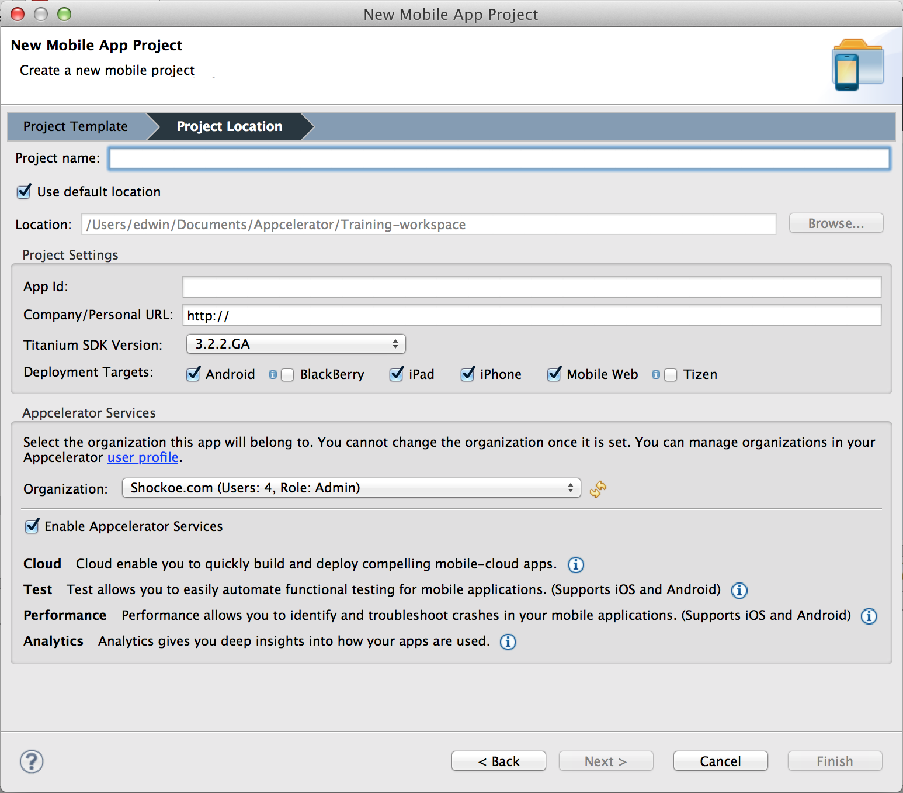

--- 

# App Registration

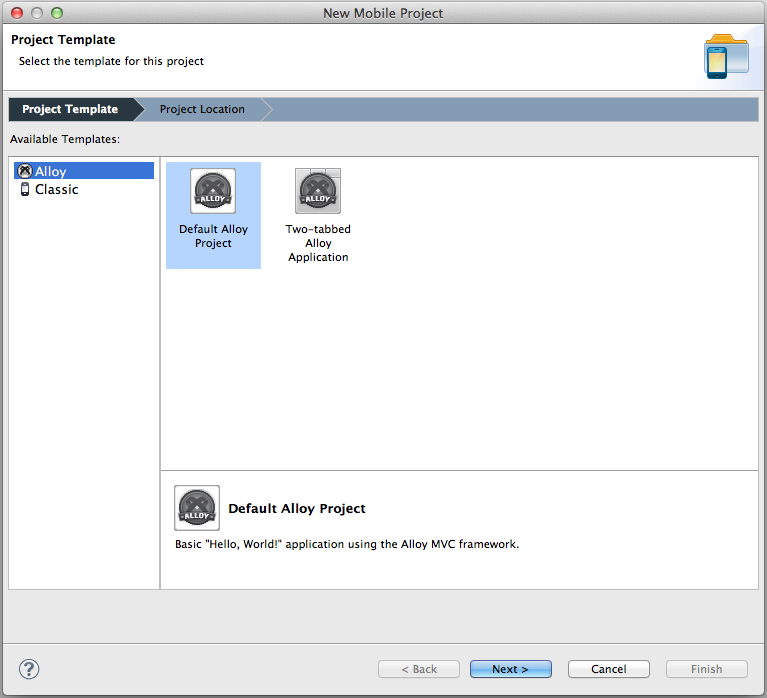
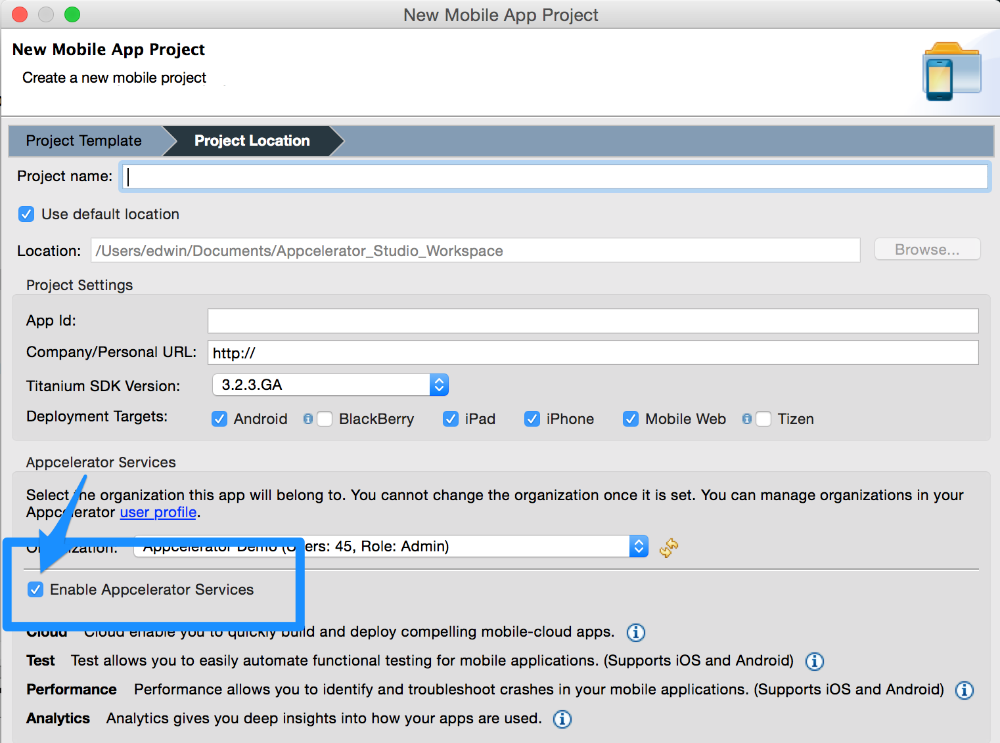

- Appcelerator Services require Titanium SDK 3.1.1 and later
- Creating a new project and enabling Appcelerator Services
- Importing a Titanium project and Enabling Appcelerator Services

> **TIP:** If more than one person is working on the same project and you try to enable Appcelerator Services after it has already been enabled once, the enablement process may freeze. To resolve this issue, copy the tiapp.xml from the user who first enabled Appcelerator Services.

--- 

# Tiapp.xml Editor - GUI mode

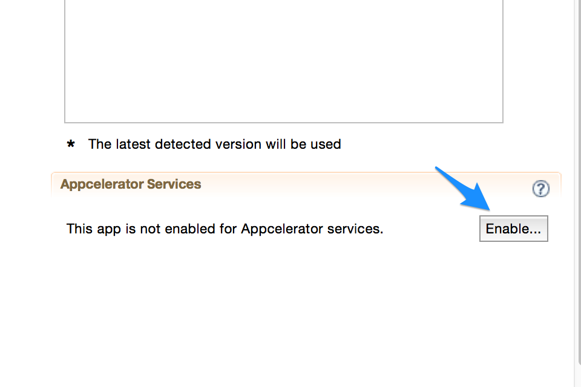

- Set App ID, version, and more
- Select Titanium SDK and platform support
- Specify modules used
- Cloud enable

--- 

# Tiapp.xml Editor - XML mode

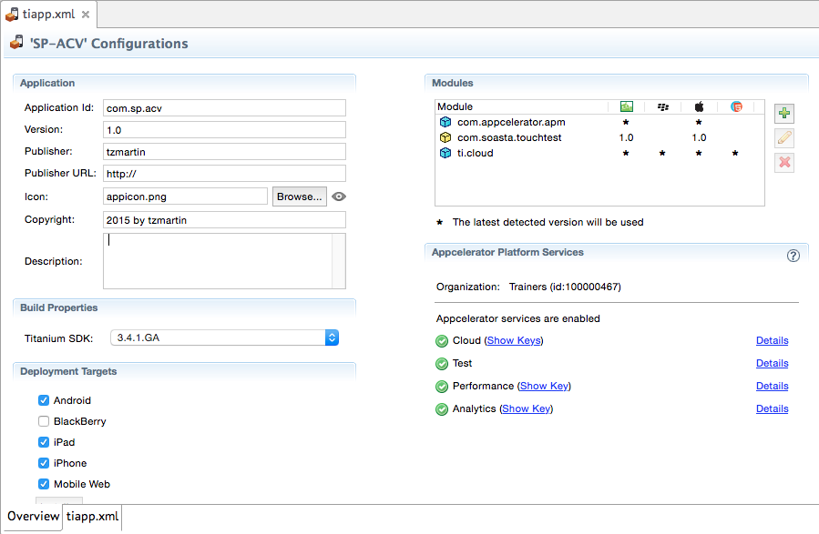

- Advanced view of your project configurations
- Configure orientation support
- Platform-specific:
  - iOS: Info.plist keys, hardware requirements, etc.
  - Android: tooling, theme, custom versioning, etc.

--- 

# Importing a Project in Studio

You need to import a project in order to work with it:

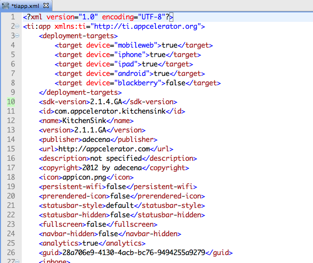
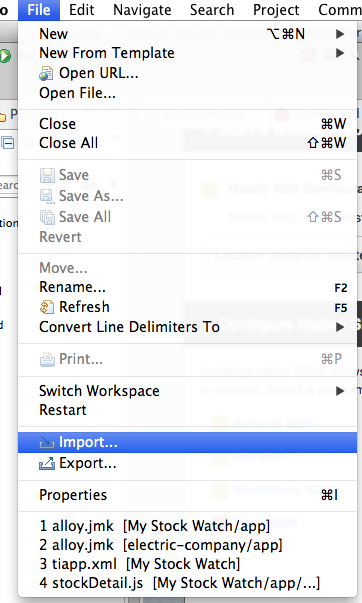
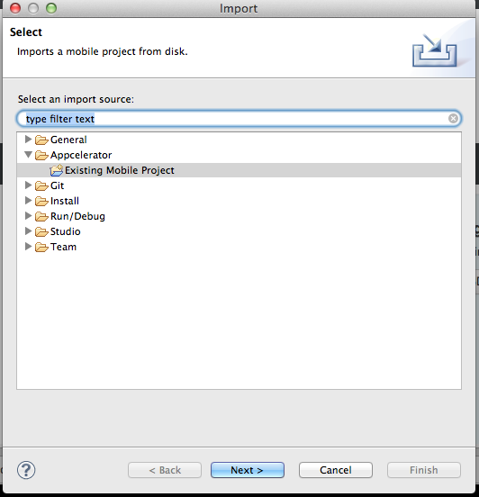

--- 

# App Registration – Imported Projects

- Check Tiapp.xml to make sure you have Development and Production API keys
- Application should appear in your Appcelerator Dashboard
- Cloud, Test, Performance and Analytics should be enabled

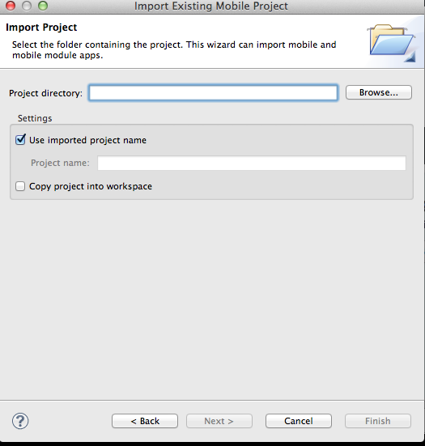

--- 

# Migrate Existing Titanium Project

- You can also move your existing Titanium projects to Appcelerator!
- Open Appcelerator Studio, go to ```File > Import``` and select *Existing Mobile Project*
- Set the Titanium SDK to the latest (2.3.3 minimum), and then compile.  Check to make sure it runs
- Enable Appcelerator services using ```tiapp.xml```, and you’re done!
- Apps already using Cloud, Analytics, Test or Performances services should contact tech support

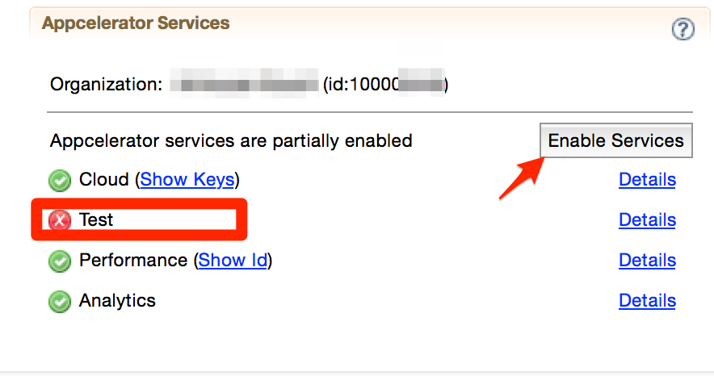

---section

# BUILDING & RUNNING PROJECTS
---

# Building a Project


- Debug, Run, and Publish menus
- Options based on targets configured in Tiapp.xml
- Studio does a "preflight" check
- For iOS installations, need to configure provisioning profiles

--- 

# Build Options

- Build once
- Choose Run > Run Configurations
- Locate by platform & project
- Or use the CLI!

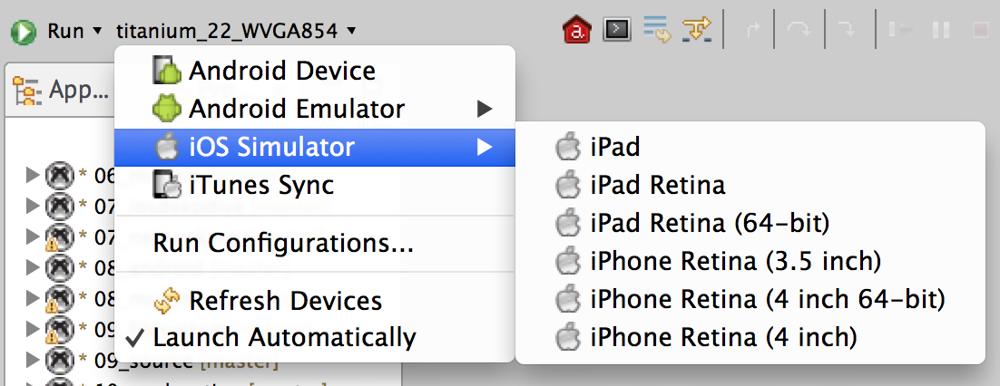

--- 

# The Command Line Interface (CLI)

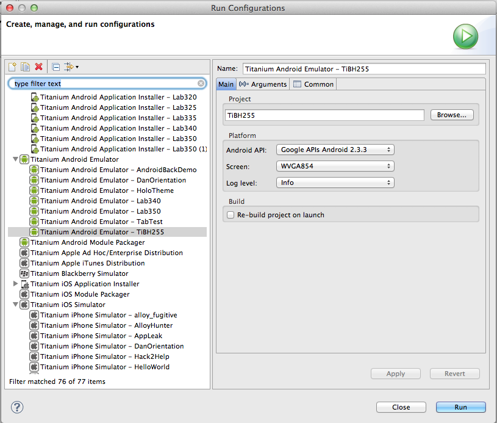

- NodeJS-based command line interface
- Integrate with custom code repositories, CI configurations, more
- Integrate with editors other than Studio
- ```$ ti setup``` (to check your current system setup)

--- 

# CLI – Checking your Environment

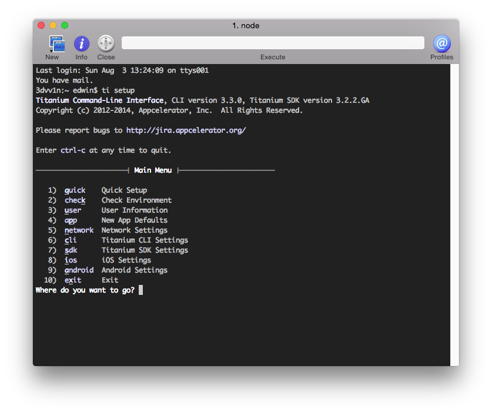

- Make sure you have everything up-to-date
- Checks different settings in your system
  - Expired Provisioning profiles
  - Emulators and Simulators installed
  - Any connected devices
- Android and iOS specific issues
- ```$ ti info```

--- 

# Try It

- Use the CLI to check your setup information
- Make sure you have everything up-to-date
- Create a new alloy project 
- Build for iOS

--- 

# CLI – Create a Project

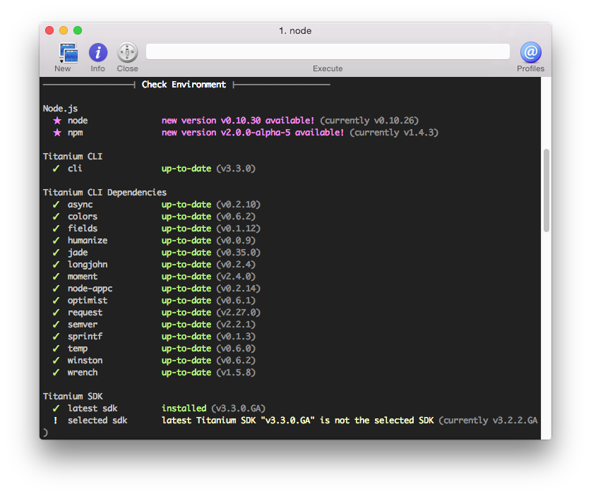

- By default the CLI will create a Legacy project (non-alloy).
- Generate an alloy project by invoking:
  - ```$ alloy new```
  - You have to be in the directory where your Titanium project is.

--- 

# CLI – Build your app

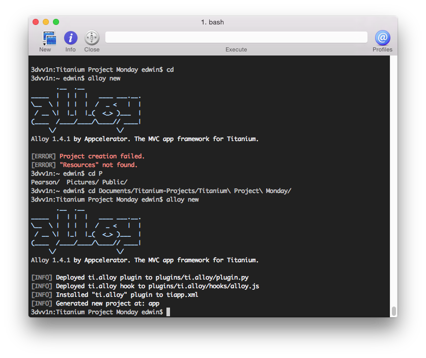

- CLI will help you if you forget parameters
- Select from a menu of options
- ```$ ti build```
  - Will prompt for platform
  - Or use:
    - ```$ti build –p ios –retina –tall```
    - ```$ti build –p android –device-id```

--- 

# Summary

In this lesson, you:

- Learned how to setup the tools and SDKs
- Learned how to create and configure a mobile project
- Built an app!
- Explored the CLI

---section

# Questions?