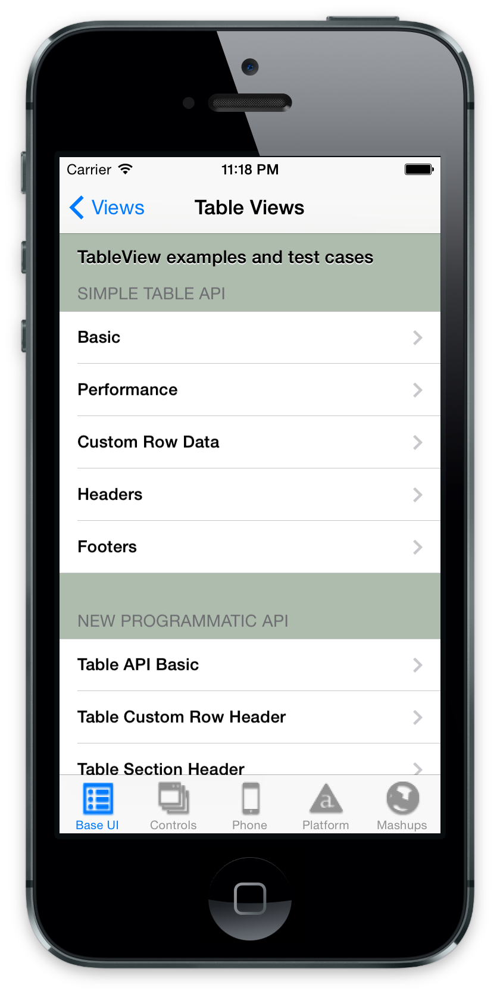
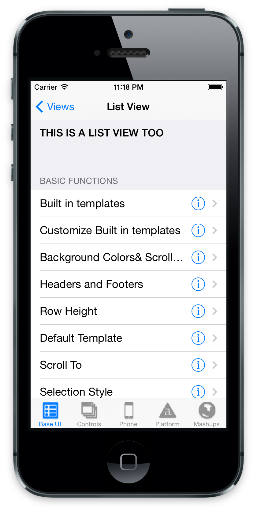
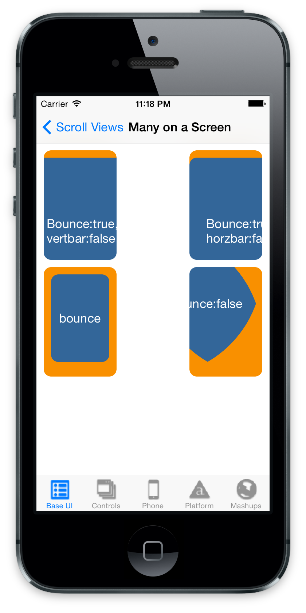
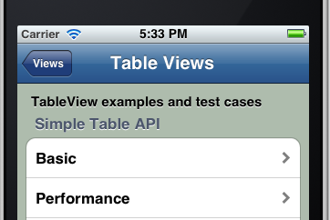
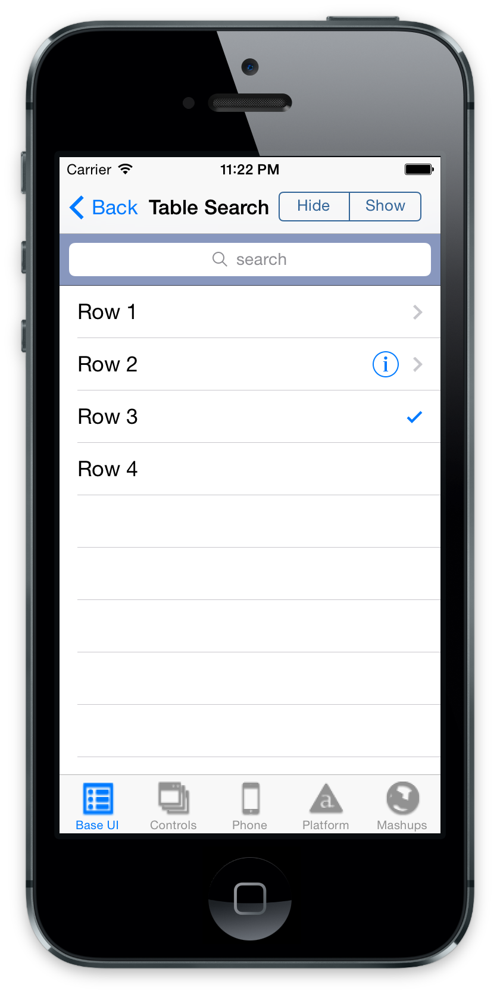
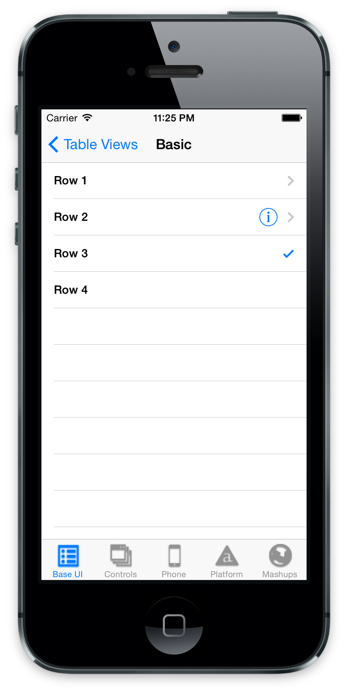
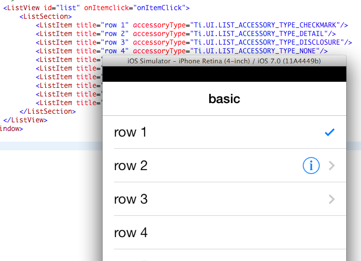

theme:appcelerator-training
tableclass:striped
progress:true

# TableViews & ListViews

Appcelerator SDK Fundamentals

---cover

# TableViews & ListViews

## Appcelerator SDK Fundamentals

---

# In this lesson, you will:

- Identify the features and uses of the list-like views
- Implement TableViews
- Implement ListViews
- Compare and contrast ListViews and TableViews

---section

# LIST-LIKE VIEWS

---

# List-like Views

- TableView
- ListView
- ScrollView





---

# TableView Characteristics

- Vertically scrolling container of data presented as rows
- Tables can contain sections, which contain rows, which can contain views
- There's an implicit section if you don't add one
- Basic row contents: title, leftImage, rightImage, indicators
- Optional: add Views as children
- Event listeners on table (preferred), section, rows, or child views

---

# ListView Characteristics

- Vertically scrolling container of data presented as items
- ListViews contain sections, which contain ListItems, which render ListDataItems
- ListSection is required; add ListItems to sections not the list itself
- ListItem = ListDataItem + ItemTemplate
- Event listeners on list itself or on child components within the ListItems

---

# ScrollView Characteristics

- Vertically or horizontally scrolling container of child views
- ScrollViews contain child Views of nearly any type
- Don't put TableViews or ListViews within a ScrollView
- Put event listeners on the child views

---

# Why Use One over the Other?

- TableViews - simpler API and usage
- TableViews - direct manipulation of child views
- TableViews - lots of code examples in docs and sample apps
- ScrollViews - horizontal scrolling
- ListViews - speed! Faster rendering and smoother scrolling even with large data sets

---section

# TABLEVIEWS

---

# TableView Basics

```xml
<TableView id="table"> 
     <TableViewRow title="row"/> 
</TableView> 
```

```javascript
// eventing (use `table` rather than `$.table` for traditional example) 
$.table.addEventListener('click', function(e) { 
     // e.row == the row that was clicked 
     // e.rowData == custom properties added to the row 
}); 
```

---

# Headers and Footer Views



```javascript
$.table.header = 'TableView examples and test cases'; 
$.table.headerView = $.simpleTableAPIView; 
$.table.footerView = $.anotherView;
```

---

# Table Search



```xml
<Alloy>
    <SearchBar id="search" barColor="#000” height="43" top="0" />
</Alloy>
```

```javascript
// For Android, use SearchView instead
<Alloy>
	<SearchView ns="Ti.UI.Android" platform="android"/>
</Alloy>
```

---

# Accessing Child Views

```xml
<TableView id="table"> 
     <TableViewRow title="row"> 
	     <Label text="A label"></Label> 
	     <ImageView image="/someimage.png"/> 
     </TableViewRow> 
</TableView> 
```

```javascript
$.table.addEventListener('click', function(e){ 
     // e.row.children[1] == the ImageView 
}) 
```

---

# Row Indicators



```javascript
/* in the TSS */ 
"#someRow": {
     hasChild: true, 
     hasDetail: true, //not available on android
     hasCheck: true 
} 
```

---

# Table View Performance

- `setData()` or `table.data` faster than `append()`
- Load only as much data as needed
- If your table has 1,000s of custom rows, you might need to rethink your UX design
- Don't use child Views, just title & row properties

---section

# LISTVIEWS

---

# ListView Sample (Alloy)

```xml
<ListView id="listView" defaultItemTemplate="template"> 
     <Templates> 
	     <ItemTemplate name="template"> 
         <ImageView bindId="pic" id="icon" /> 
         <Label bindId="info" id="title" /> 
	     </ItemTemplate> 
     </Templates> 

     <ListSection headerTitle="Fruit"> 
       <ListItem info:text="Apple" pic:image="/apple.png" /> 
       <ListItem info:text="Banana" pic:image="/banana.png" /> 
     </ListSection> 
</ListView> 
```

```javascript
// in associated TSS file: 
"#icon" : { 
     width: '50dp', height: '50dp', left: 0 
}, 
"#title" : { 
      color: 'black', 
      font: { fontFamily:'Arial', fontSize: '20dp', fontWeight:'bold' }, 
      left: '60dp', top: 0
 } 
```

---

# ItemTemplates

- You must define a template for the ListView
- A ListView can have multiple templates, but one must be the defaultTemplate
- Each template can have child templates, which define what components are contained in the ListItem (row)
- There are built-in templates supported on iOS

---

# Item Accessories

`Ti.UI.LIST_ACCESSORY_TYPE_`

- `CHECKMARK`
- `DETAIL`
- `DISCLOSURE`
- `NONE`



---

# ListView Eventing

```javascript
// use the special 'itemclick' event with ListViews 
listView.addEventListener('itemclick', function(e){ 
     // grab a handle to the list item (row) that was clicked 
     var item = e.section.getItemAt(e.itemIndex); 
     // modify properties of list item: 
     if (item.properties.accessoryType == Ti.UI.LIST_ACCESSORY_TYPE_NONE) { 
	item.properties.accessoryType = Ti.UI.LIST_ACCESSORY_TYPE_CHECKMARK; 
     } else { 
	item.properties.accessoryType = Ti.UI.LIST_ACCESSORY_TYPE_NONE; } 

     // once you've modified the properties, you must update the item 
     e.section.updateItemAt(e.itemIndex, item); 

     // use bindId (not bindID!) to determine which child component was clicked 
}); 
```

---

# Additional Features

- Header and footer views
- Search viewson Android, the search box can be shown outside the ListView
- iOS: pull to refresh support, native editing support

---section

# COMPARE & CONTRAST

---

# TableView vs. ListView

|TableView|ListView|
|-|-|
|View-oriented architecture for maximum flexibility|Data-oriented architecture for maximum performance|
|Sections implicit & can generally be ignored|Sections required|
|Bind events to table, sections, rows, or child Views|Bind events to ListView or child components (via template)|
|Relatively easier to code|Faster|

---

# Summary

In this lesson, you:

- Identified the features and uses of the list-like views
- Implemented TableViews
- Implemented ListViews
- Compared and contrasted ListViews and TableViews

---section

# Questions?