theme:appcelerator-training
tableclass:striped
progress:true

# UI/UX Design

Appcelerator SDK Fundamentals

---cover

# UI/UX Design

## Appcelerator SDK Fundamentals

--- 

# In this lesson, you will:

- Explore the importance of UI/UX design
- Identify the principles of mobile UX design
- Explore input/output options available in a mobile app
- Incorporate brand & personality in your app
- Identify tools for UI/UX design
- Identify best practices for testing and the development cycle

---section 

# UI/UX Design is Critical

--- 

# Basics of UX

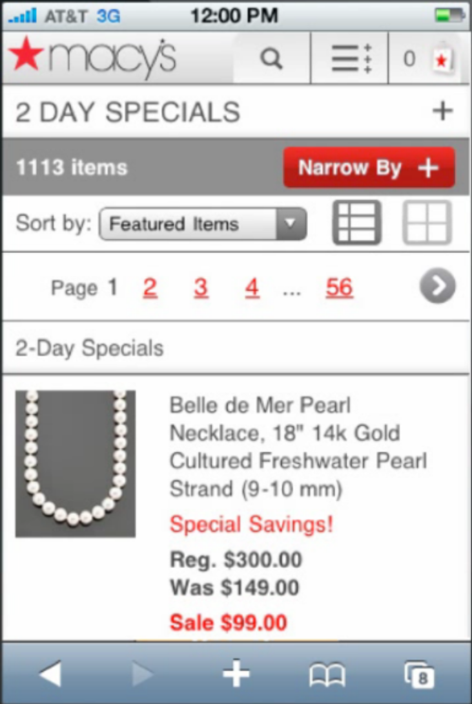
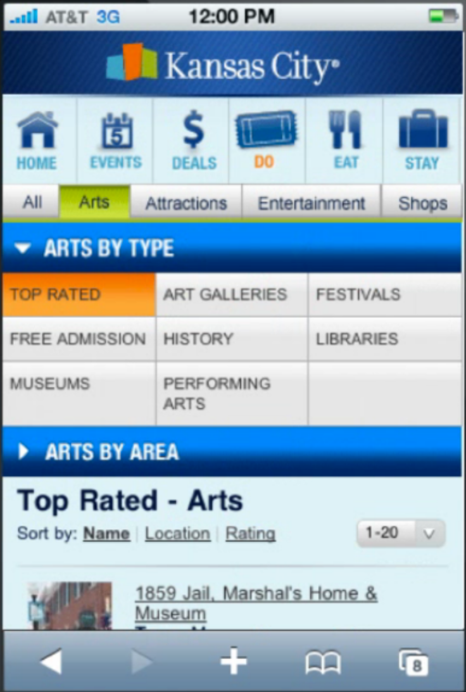
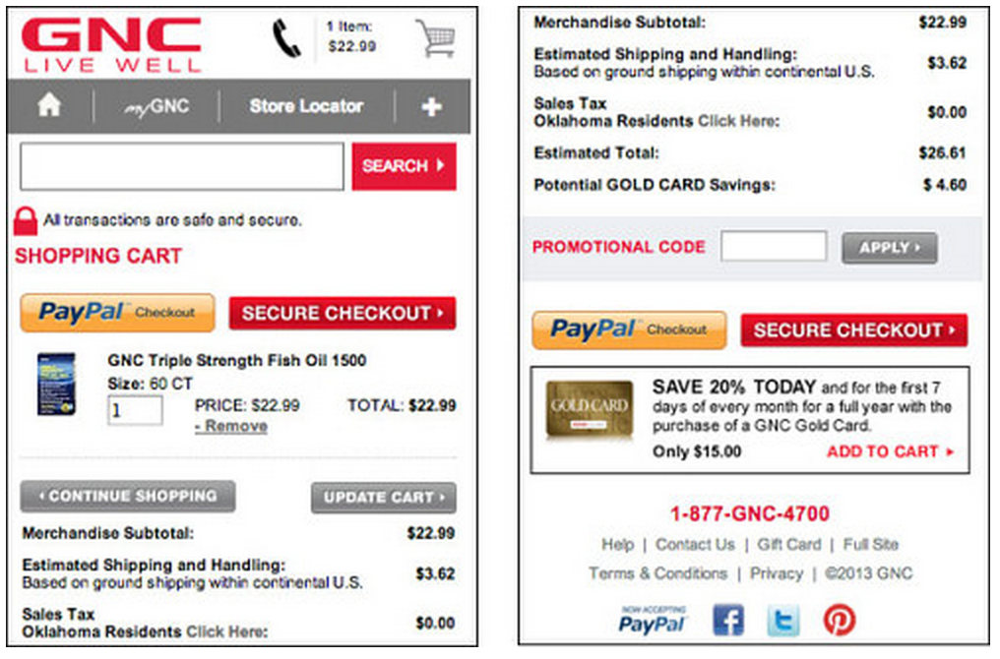

--- 

# Critical Questions

Can you answer the following:

- What problem(s) am I solving?
- Who are my key users?
- What are their needs?

--- 

# Focus on Needs

Segment Your Customers
Focus on your primary consumer! (The one that makes you profitable)
Remove your personal opinion! (You're not the target consumer)

---section 

# Principles of UI/UX Design

--- 

# You are Married to your Mobile

- Mobile computing is fundamentally different than desktop/laptop
- Design for real mobile interfaces (voice, messaging, location...)
- Users take their mobile devices everywhere
- People's identities are wrapped up in their mobile devices

--- 

# Hardware

- Mobile hardware is confined by nature
- Freedom in the framework
- Target 'lowest common' hardware

--- 

# Screens

- Size and density variations
- But that's an opportunity
- Target your primary consumers, accommodate your secondary consumers
- Don't design once, use everywhere

--- 

# Mobile Challenges

- Handset usage: One-handed, on the go
- Tablet usage: Two-handed, lean-back
- Users can, and do rotate their devices for various reasons
- Plan for abandon

--- 

# Sketch It!

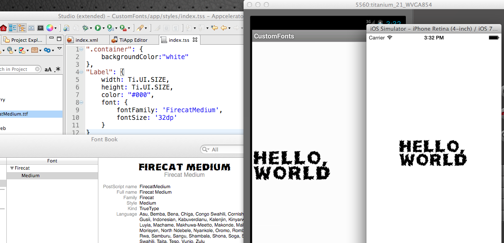

--- 

# Remember your MVP

- Minimum Viable Product = just the required features
- More is not better
- Watch out for feature creep
- Target your primary audience

---section 

# Branding

--- 

# Brand Documents

- Understanding Your Consumer
- Develop a Single Page Brand
- Know the Emotion, Style & Location

--- 

# Incorporation of Brand

App Icons & Default Screens
Colors & UX
UI Components

--- 

# Custom Fonts

- Quick & easy way to reinforce brand
- Don't overuse
- Adhere to the brand
- **TTF** and **OTF** fonts support
- Google Fonts, [FontSquirrel.com](http://FontSquirrel.com), and others
- Watch licensing issues

--- 

# Custom Fonts

- Put in assets/fonts or assets/platform/fonts
- For fontFamily (default):
  - Android use file name
  - iOS use PostScript name

> **TIP:**rename file to PostScript name:
> 1. Install font
> 2. Open FontBook & find font
> 3. Press CMD + i to find PostScript name

---section 

# Inputs & Outputs

--- 

# Accelerometer

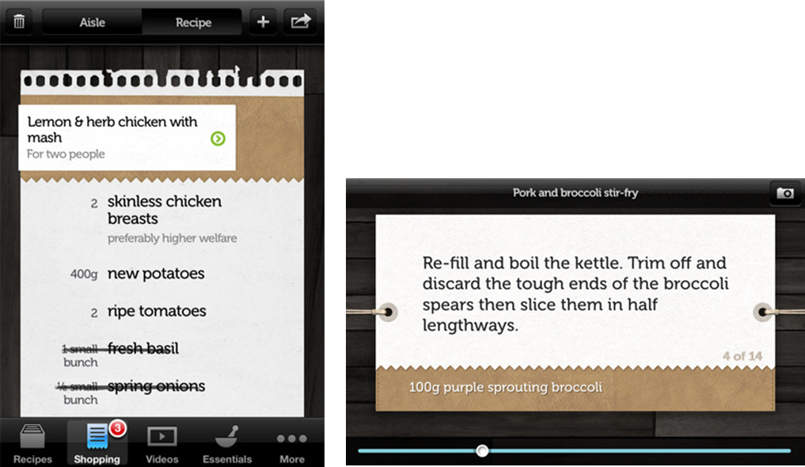

- Directional Information
- Use in conjunction with Compass
- Directional Scrolling
- Dictates Orientation

--- 

# Orientation

- You must lock your orientation, or design for both!
- User's rotate device for a variety or reasons, your app must work in both orientations
- Better yet, design for both!

--- 

# Orientation

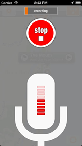

--- 

# Microphone & Audio

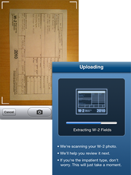

- Input & Output
- Guide a user with instruction
- Provide positive/negative feedback
- Unique and interesting UX

--- 

# Camera & Video

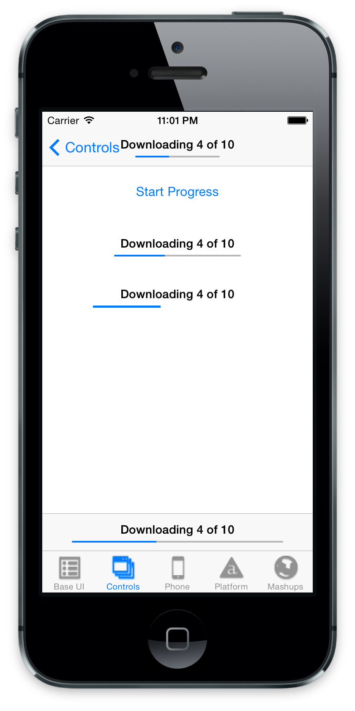

- Record & Edit
- Instant Result & Gratification
- Multiple Uses
- Augment Experience

--- 

# Loading Indicators

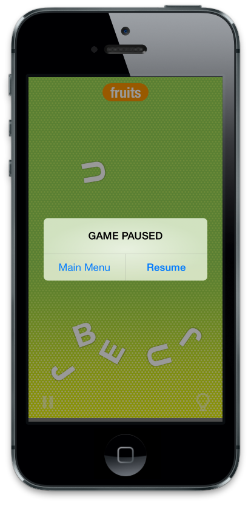

- Provide feedback to user
- Provide information
- Show progress
- Pass/Fail
--- 

# Feedback

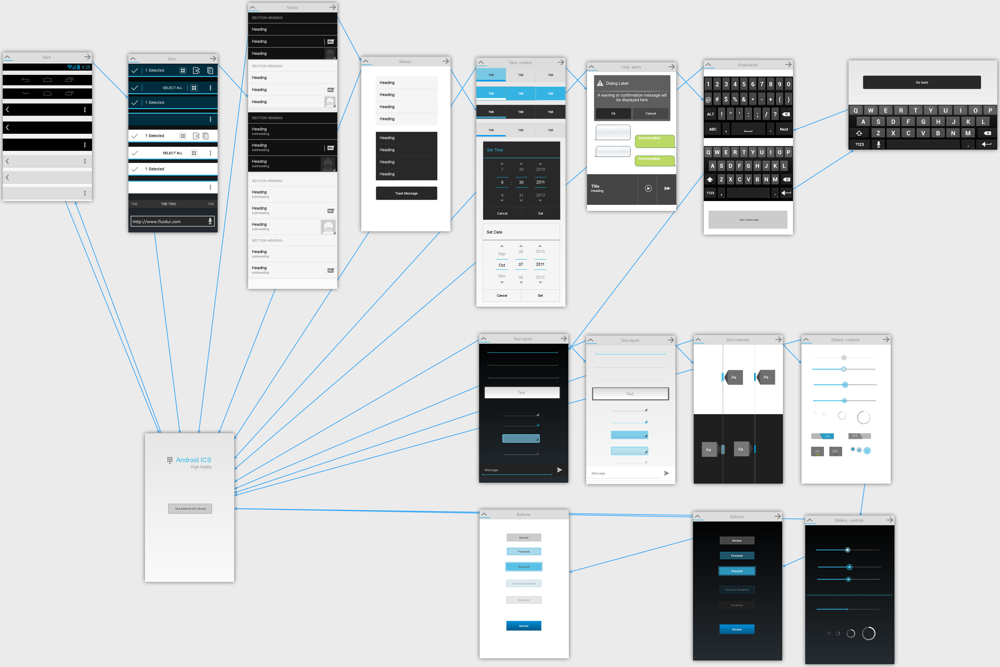

- Alerts are ok
- Action screens are good
- Active results are best

--- 

# Don't Over Dialog

- Only provide it when necessary
- Don't remind me constantly
- Are you serving the needs?
- Does the data really fit?
- Are you just showing off?

---section 

# Tools of the Trade

--- 

# UX Design Tools

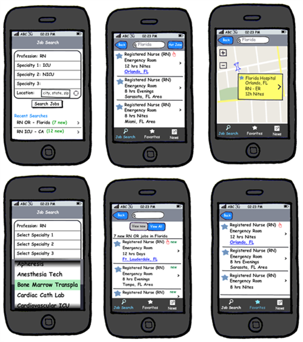
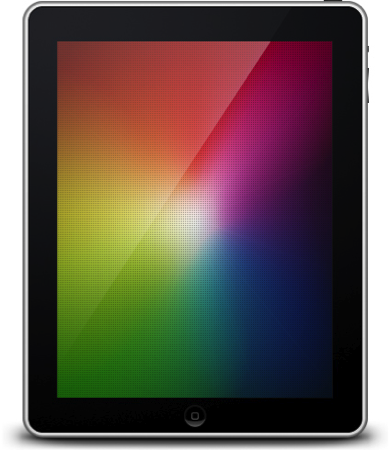

- Paper & pencil!
- Balsamiq
- Fluid
- What’s your favorite?

--- 

# UI Design Tools

- Raster: Photoshop, Pixelmator, Gimp, etc.
- Vector: Fireworks, Inkscape, etc.
- Other: Keynote/PowerPoint
Start with a template or follow Apple/Android human interface guidelines

--- 

# Live View tools

- Quick device feedback
- Check sizes and layout
- Great for app demos
- iOS: Reflector, AirServer, LiveView
- Android: Miracast, ChromeCast, Mirror, Droid@Screen 

---section 

# Development & Testing
--- 

# How to Test

- Low number of your primary audience
- LiveView apps work well
- Do not 'own' the project

--- 

# Using Appcelerator for Rapid Testing

- Bring your UI to life
- Bring important Design elements (Fonts, colors, positioning)
- Place dead images
- Use test content ('Lorem Ipsum’)

--- 

# Iteration

- Change early and often
- Ensure your changes are justified
- Pivoting 180 degrees is not bad
- Ask yourself the three questions...

--- 

# Continual Testing

- Keep testing hypotheses
- You are never complete!
- Remember your MVP

--- 

# Summary

In this lesson, you:

- Explored the importance of UI/UX design
- Identified the principles of mobile UX design
- Explored input/output options available in a mobile app
- Incorporated brand & personality in your app
- Identified tools for UI/UX design
- Identified best practices for testing and the development cycle

---section

# Questions?