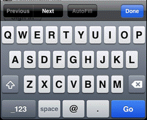
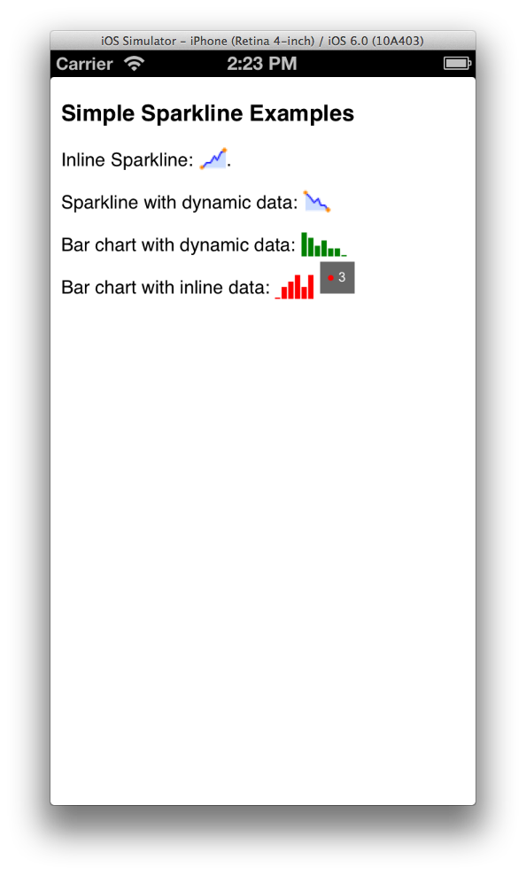
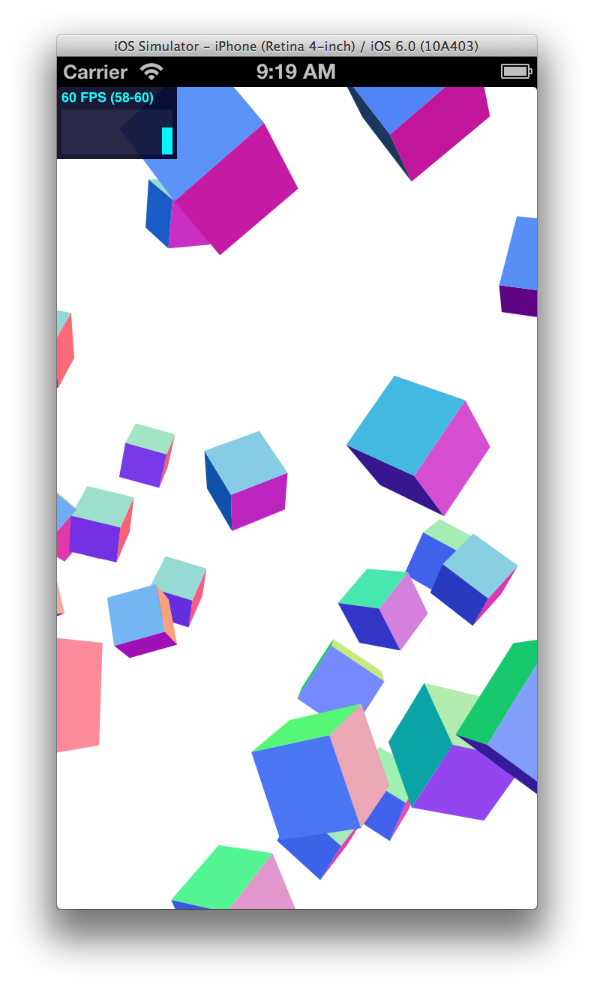
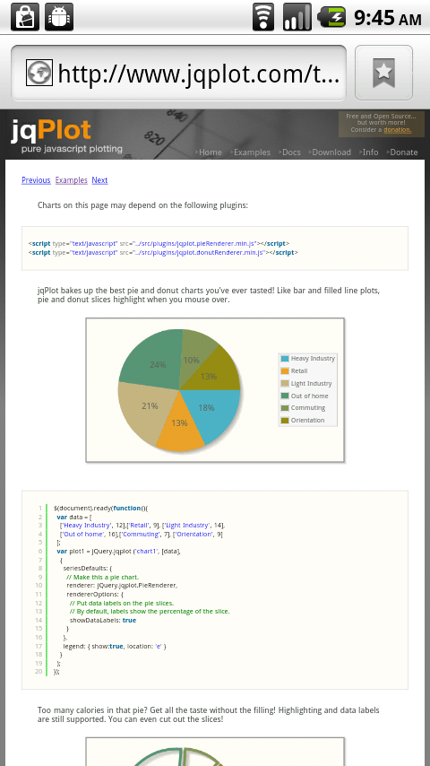
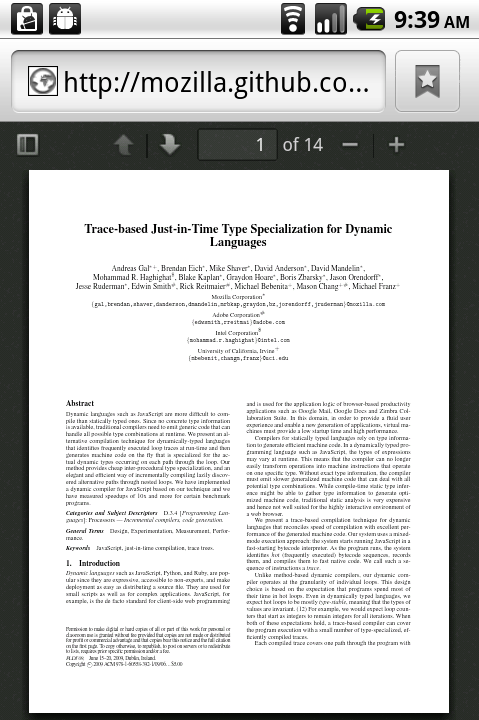
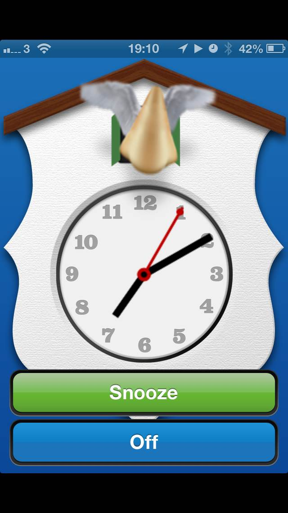
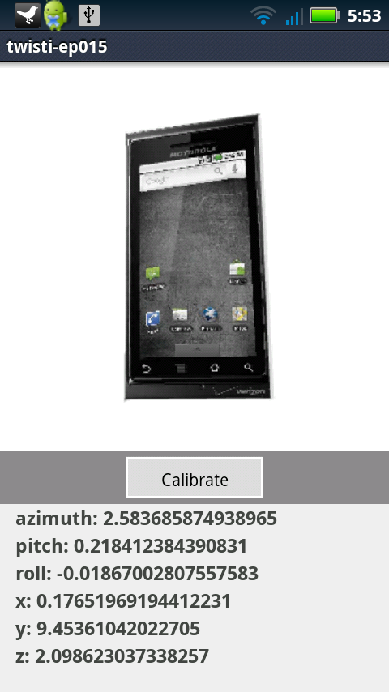

theme:appcelerator-training
tableclass:striped
progress:true
shadows:true

# WebViews

Appcelerator SDK Fundamentals

---cover

# WebViews

## Appcelerator SDK Fundamentals

--- 

# In this lesson, you will:

- Integrate the WebView component into your application
- Explore WebView gotchas that you must watch out for in your apps
- Identify novel uses of the WebView

--- 

# Why the WebView?

- You've got HTML content to show
- Canvas, SVG, MathML or other browser-compatible rendering
- Scraping web content
- Integrate existing web content (news pages, newsletter signup forms, etc.)
- Long data entry forms in your app

--- 

# When not to use the WebView

- To render your whole UI
- If you need easy integration with the Appcelerator APIs or device/OS features
- In a TableView
- When performance is critical

---cover

# Remote Web Content

```xml
<Alloy> 
     <Window class="container"> 
       <WebView url='http://www.example.com'>
     </Window> 
</Alloy> 
```

```javascript
var webview = Ti.UI.createWebView({ 
  url:'http://www.example.com' 
}); 
win.add(webview); 
```

--- 

# Local Web Content

```xml
<Alloy> 
     <Window class="container"> 
     	<WebView url='/myfile.htm'> 
     </Window> 
</Alloy> 
```

```javascript
var webview = Ti.UI.createWebView({ 
  url:'/myfile.html' 
}); 
win.add(webview); 
```

---

> **NOTE:** 

- HTML, JS, etc. in the assets folder with Alloy
- In Resources for non-Alloy
- OK to put into subdirectories of those locations
- Leading slash required for Android

---code 

# Inline HTML

```xml
<Alloy> 
     <Window class="container"> 
	     <WebView id='web'> 
     </Window> 
</Alloy> 
```

```javascript
// typically, html is retrieved from web 
// and rendered as inline content 
$.web.html = '<p>This is <b>HTML</b>.</p>'; 
```

Or

```javascript
var webview = Ti.UI.createWebView({ 
  html:'<p>This is <b>HTML</b>.</p>' 
}); 
win.add(webview); 
```

--- 

# Viewport Control

```xml
<meta name="viewport" 
	content="width=device-width, minimum-scale=1.0, 
	maximum-scale=1.0, user-scalable=no"> 
```

- Apple docs: [http://goo.gl/qnLSs](http://goo.gl/qnLSs)
- Mozilla Dev Net: [http://goo.gl/t5GUd](http://goo.gl/t5GUd)
- Quirksmode: [http://goo.gl/ImVYk](http://goo.gl/ImVYk)

--- 

# WebView Keyboards




```xml
<input type='text' placeholder="Full name"/> 
<input type='url'/> 
<input type='email'/> 
<input type='number'/> 
<input type='tel'/> 
```

---section

# WebView Considerations

---

# Communicating With The Wrapper

- Remote web content has no access to Appcelerator APIs
- Limited Appcelerator API access within local web pages:
  - Logging APIs (Ti.API.info and friends)
  - App-level Events (Ti.App.fireEvent/addEventListener)
- Native APIs must be accessed indirectly via application level events

---

# WebView Gotchas

- Among the most expensive components to create
- Should not be embedded in other scrollable views
- Common misuse - inside TableViewRows (bad performance)
- It is possible to implement your whole UI in HTML/CSS, but native UI is what your users expect
---

# Android Compilation

By default, Appcelerator processes all JavaScript in the resources directory on Android to optimize for native apps.

- Must override for "hybrid apps" to preserve HTML paths
- Entry in `tiapp.xml`
	- `<property name="ti.android.compilejs" type="bool">false</property>`

---section

# Novel Uses

--- 

# Integrating Web Tools






- CSS 3D, Canvas, PDF.js, etc.
- Canvas not supported on all Android < ~4.0.3
- jQuery charting libraries, such as jqPlot, Sparklines, Flot, and others

--- 

# SVG Transformations

- Transform images
- 2D/3D animations




--- 

# Embedded Documents on iOS

WebView on iOS can display embedded:

| Types | |
|-|-|
| PDF | PowerPoint |
| Keynote | Word |
| Numbers | RTF |
| Pages | RTF Directory |
| Excel | | | 

--- 

# Summary

In this lesson, you:

- Integrated the WebView component into your application
- Explored WebView gotchas that you must watch out for in your apps
- Identified novel uses of the WebView

---section

# Questions?